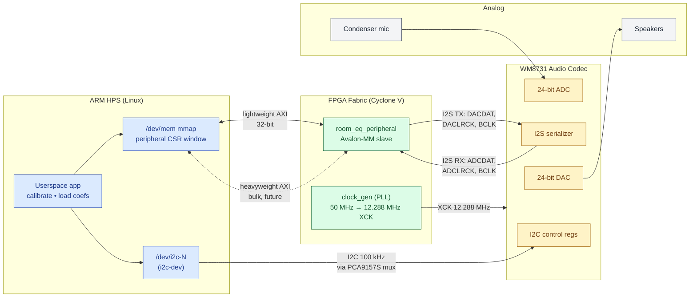
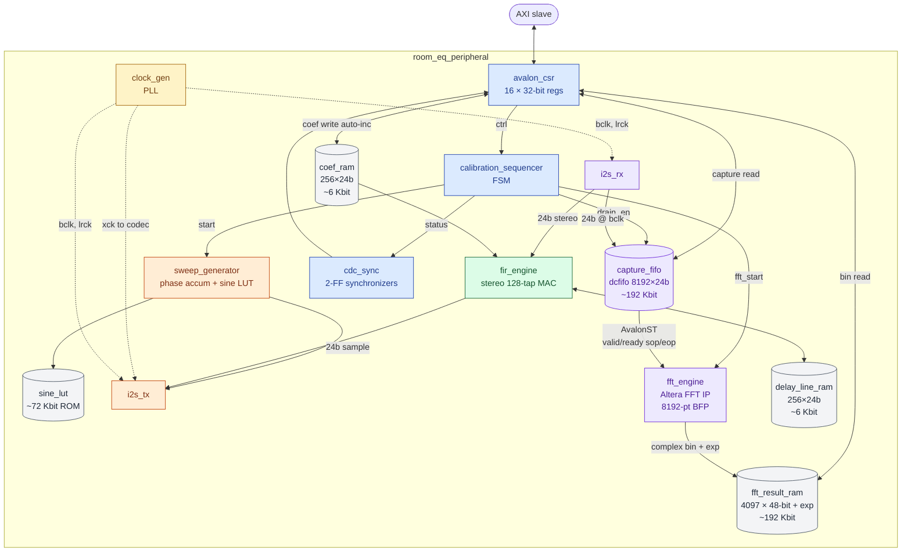
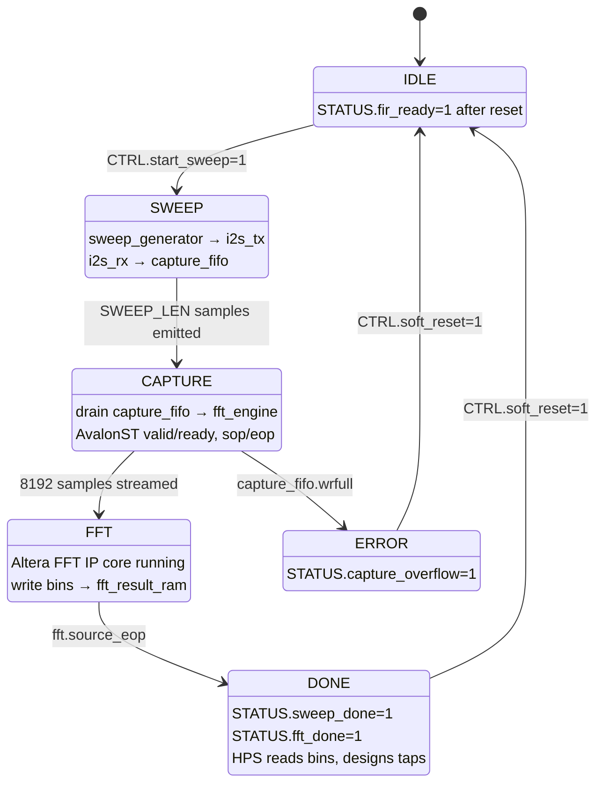

# Real-Time Room EQ Correction — Design Document

*Embedded Systems Project — DE1-SoC*
Jacob Boxerman (JIB2137) • Roland List (RJL2184) • Christian Scaff (CTS2148)
April 17, 2026

---

## 1. Introduction

Every listening room colors the audio played inside it. Room modes boost or cancel specific frequencies, speaker placement tilts the stereo balance, and absorptive materials roll off high frequencies. This project builds a **closed-loop room-equalization system** on the Terasic DE1-SoC that measures a particular room's response with a swept-sine excitation, designs a compensating FIR filter, and applies that filter to all subsequent audio in real time.

**High-level flow.** On user request, the FPGA plays a 5-second logarithmic sine sweep (20 Hz – 20 kHz) out the LINE OUT jack through the speakers. A condenser microphone at the listening position captures the room's response via LINE IN. The FPGA stores the captured samples in on-chip BRAM and runs them through the Altera FFT IP core to produce a complex frequency-domain room response `H(f)`. The ARM HPS reads those complex bins over the lightweight AXI bridge, computes the inverse target curve `C(f) = T(f) / H(f)` in software, synthesizes a 128-tap Q1.23 FIR via windowed IFFT, and writes the taps back to a dual-port coefficient RAM inside the FPGA. From that point forward, the FPGA's stereo FIR engine filters every incoming audio sample in real time.

**Design commitments.** 48 kHz sample rate, 24-bit audio samples, 8192-point FFT, 128 FIR taps, block-floating-point (BFP) FFT output, Altera `dcfifo` for clock-domain crossing, lightweight AXI for control/status registers and heavyweight AXI for bulk capture / coefficient transfer.

**Scope.** Stereo, single listening position, offline calibration. Out of scope: multi-position averaging, subwoofer phase alignment, runtime adaptation, crossovers.

**Glossary.**
- *I2S* — Inter-IC Sound, 3-wire serial audio bus (BCLK, LRCK, data).
- *FIR* — finite impulse response filter; a tapped-delay-line convolution.
- *BRAM* — on-chip FPGA block RAM (~4,450 Kbit on the DE1-SoC).
- *AXI* — Intel/ARM AMBA bus used between the HPS and the FPGA fabric.
- *CDC* — clock-domain crossing.
- *BFP* — block floating-point; a shared exponent across an FFT block.
- *Q1.23* — 24-bit two's-complement, 1 integer bit + 23 fractional bits.

---

## 2. System Block Diagram

The system is logically split into four domains: the ARM HPS (Linux userspace), the FPGA fabric (all custom hardware), the on-board Wolfson WM8731 audio codec, and the external analog path (speakers, microphone, amplifier). The FPGA fabric presents a single Avalon-MM slave peripheral — `room_eq_peripheral` — to the HPS. Everything the HPS does happens through that peripheral's register window; everything the codec does happens through I2S (data) and I2C (control).

*(Source: [`assets/system_block.mmd`](assets/system_block.mmd). GitHub renders the Mermaid below directly. For PDF, render to SVG with `mmdc -i assets/system_block.mmd -o assets/system_block.svg` and swap the block for an `` reference.)*



**Arrow walk.**

1. **`APP ↔ MMAP ↔ PERIPH` (lightweight AXI, 32-bit, HPS clock domain ~100 MHz).** The userspace app maps the peripheral's 64-byte register window into its address space via `/dev/mem` and `mmap()`. Every user-initiated action — start sweep, poll status, read an FFT bin, write a filter tap — is a 32-bit load or store against that window. The lightweight AXI bridge is sufficient for the register interface because no single transaction exceeds 4 bytes.

2. **`APP ↔ MMAP ↔ PERIPH` (heavyweight AXI, 32-bit, burst).** During coefficient write-back (128 taps × 2 channels × 4 bytes = 1 KB) and FFT-bin readback (4097 complex bins × 8 bytes ≈ 32 KB), the driver could switch to the heavyweight AXI bridge for burst efficiency. In the baseline design we keep all traffic on lightweight AXI (traffic is small, latency is uncritical at calibration time) and reserve the heavyweight bridge as a future optimization.

3. **`APP → I2CDEV → I2C_IN` (I2C, 100 kHz).** Codec initialization uses the Linux `i2c-dev` kernel driver against the DE1-SoC's HPS-side I2C controller. The PCA9157S mux routes HPS I2C to the WM8731 control port; the FPGA does not touch I2C in this design. Initialization sets sample rate (48 kHz), word length (24-bit), I2S master/slave mode, and input-path selection (LINE IN).

4. **`PERIPH ↔ SER` (I2S: BCLK, LRCK, DACDAT, ADCDAT, 24-bit frames, 1.536 MHz BCLK at 48 kHz).** The FPGA is the I2S master. It generates BCLK (≈ 64 × Fs = 3.072 MHz), LRCK (Fs = 48 kHz), DACDAT (data out), and samples ADCDAT (data in) on BCLK edges. Left and right channels time-multiplex into each 64-bit I2S frame.

5. **`PLL → XCK` (12.288 MHz, codec master clock).** The FPGA's PLL derives 12.288 MHz (256 × Fs) from the 50 MHz board oscillator and drives it out on AUD_XCK. The codec uses XCK internally to clock its ADC and DAC.

6. **`MIC → ADC` and `DAC → SPK` (analog).** The condenser mic is LINE-IN coupled through an external preamp (the WM8731's on-chip mic preamp is noisy). The speakers are driven from LINE OUT through a consumer-grade amplifier.

**Clocks summary.**

| Clock     | Freq             | Source                  | Crosses to |
|-----------|------------------|-------------------------|------------|
| `hps_clk` | ~100 MHz         | HPS                     | AXI bridge → `sys_clk` |
| `sys_clk` | 50 MHz           | Board oscillator        | Peripheral internal, AXI slave |
| `xck`     | 12.288 MHz (256Fs) | `clock_gen` PLL       | Out to codec |
| `bclk`    | 3.072 MHz (64Fs) | Derived in I2S logic    | I2S domain |
| `lrck`    | 48 kHz (Fs)      | Derived in I2S logic    | I2S domain |
| `fft_clk` | = `sys_clk`      | Same                    | FFT engine |

Clock-domain crossings: `capture_fifo` (dcfifo) bridges `bclk → fft_clk`; the `cdc_sync` 2-FF synchronizers carry single-bit status (e.g., `sweep_done`) between `fft_clk` and `sys_clk`.

---

## 3. Custom Peripheral Architecture

`room_eq_peripheral` is a single Platform Designer component implemented in Verilog. Internally it is organized around three data paths: the **sweep-out path** (HPS trigger → sweep generator → I2S TX), the **calibration path** (I2S RX → capture FIFO → FFT engine → result RAM → HPS read), and the **real-time audio path** (I2S RX → FIR engine → I2S TX). A central `calibration_sequencer` FSM arbitrates access to shared resources during calibration; once calibration finishes, the FSM rests in `DONE` and the real-time path runs unattended.

*(Source: [`assets/peripheral_internals.mmd`](assets/peripheral_internals.mmd). Color code: blue = control/status, orange = sweep-out path, purple = calibration path, green = real-time audio path, grey = memories.)*



### Calibration sequencer FSM

The `calibration_sequencer` owns the calibration path's temporal ordering. It is at rest in `IDLE` during real-time playback; a sweep trigger takes it through the full measurement cycle exactly once and returns it to `IDLE`.

*(Source: [`assets/calibration_fsm.mmd`](assets/calibration_fsm.mmd).)*



**Bit widths on every non-trivial wire.** All audio samples are **24-bit signed** (Q1.23 on the FIR path, plain two's-complement PCM elsewhere). FFT output bins are **24-bit real + 24-bit imaginary** with a single **6-bit block exponent** per FFT frame (BFP). Register-window reads/writes are **32-bit**. BRAM addresses inside each module are minimum-width (e.g., 13-bit for the 8192-entry capture FIFO, 7-bit for 128 FIR taps, 13-bit for the 4097-entry `fft_result_ram`).

**Handshake / backpressure protocols.**

- **`capture_fifo` ↔ `fft_engine`** uses **AvalonST with `valid`/`ready` on both sides and `sop`/`eop` packet framing**. The sequencer asserts `drain_enable` after `sweep_done`; the FIFO produces one sample per cycle while `ready=1`. The FFT IP core asserts `sop` at bin 0 and `eop` at bin 8191 of the input packet; the core's output reuses the same framing and writes into `fft_result_ram` accompanied by the block exponent on a sideband signal.
- **HPS ↔ `coef_ram`** uses a **write-address-auto-increment** protocol. The HPS writes the first tap index to `COEF_ADDR`, then streams 128 × 2 = 256 writes to `COEF_DATA`. Each `COEF_DATA` write stores the value at `coef_ram[COEF_ADDR]` and increments `COEF_ADDR`. A read of `STATUS.fir_ready` confirms the engine has swapped in the new coefficients.
- **HPS ↔ `fft_result_ram`** uses the same auto-increment scheme: write `FFT_ADDR`, then alternate reads of `FFT_DATA_RE` and `FFT_DATA_IM`. `FFT_DATA_IM` reads bump the pointer. `FFT_EXPONENT` is read once per full sweep.
- **`cdc_sync`** carries single-bit status lines (`sweep_done`, `capture_overflow`, `fft_done`) from `fft_clk` to `sys_clk` via the canonical 2-flip-flop synchronizer.

**On-chip memories summary.**

| Memory             | Contents                              | Size          | Ports       |
|--------------------|---------------------------------------|---------------|-------------|
| `sine_lut`         | Quarter-wave sine, 4096 entries × 18-bit | ~72 Kbit (4096×18) | 1-R ROM |
| `capture_fifo`     | Captured mic samples, 8192 × 24-bit   | ~192 Kbit     | dcfifo, W/R on different clocks |
| `fft_result_ram`   | 4097 complex bins × (24+24 bit)       | ~192 Kbit     | 1-W, 1-R dual-port |
| `coef_ram`         | 128 taps × 24 bit × 2 ch              | ~6 Kbit       | 1-W (HPS), 1-R (FIR) dual-port |
| `delay_line_ram`   | 128 past samples × 24 bit × 2 ch      | ~6 Kbit       | 1-W, 1-R circular |
| FFT IP internal    | Twiddle factors + butterfly ping-pong | ~50 Kbit      | internal |
| **Total**          |                                       | **~518 Kbit** | — (~12% of 4,450 Kbit) |

Note: the 72 Kbit sine LUT is an upper bound — with 18-bit samples and quarter-wave symmetry we actually store 4096 × 18 = 72 Kbit. If BRAM pressure rises we can fall back to 1024 × 18 = ~18 Kbit with interpolation; the resource budget still fits comfortably.

---

## 4. Algorithms

### 4.1 Log sine-sweep generation (FPGA)

A logarithmic sweep has instantaneous frequency `f(t) = f0 · (f1/f0)^(t/T)`. The phase is `φ(t) = 2π · f0 · T · [(f1/f0)^(t/T) − 1] / ln(f1/f0)`. Rather than compute the exponential per sample, the `sweep_generator` uses a phase accumulator whose increment itself grows geometrically:

```
// f0 = 20 Hz, f1 = 20000 Hz, T = 5 s, Fs = 48 kHz, N = T·Fs = 240000
// phase_inc[n] = round(2^32 · f0 · (f1/f0)^(n/N) / Fs)
// Precompute phase_inc[n] via HPS or unroll as a simple multiply-exp pipeline:
phase := 0
for n in 0..N-1:
  phase_inc_ratio := exp(ln(f1/f0) / N)      // precomputed constant
  phase_inc       := phase_inc · phase_inc_ratio
  phase           += phase_inc
  idx             := phase[31:19]             // top 13 bits → sine LUT index
  sample          := sine_lut[idx]            // 18-bit signed, scaled to 24
  emit sample on DACDAT
```

In hardware we implement the ratio as a fixed-point multiplier running once per output sample and a 32-bit accumulator. The 13 MSBs of the accumulator index a quarter-wave-compressed `sine_lut`; the next two bits determine quadrant for sign/mirror logic.

### 4.2 FFT IP core handshake (FPGA)

The Altera FFT MegaCore is configured as: 8192 points, streaming architecture, block-floating-point output, natural output ordering. The `calibration_sequencer` runs:

```
wait for sweep_done                          // I2S RX has filled capture_fifo
assert drain_enable → capture_fifo
stream 8192 × 24b samples into fft.sink (valid/ready, sop on first, eop on last)
monitor fft.source; for each (re, im, exp) output:
  write to fft_result_ram[bin_idx]
  if bin_idx == 4096: latch FFT_EXPONENT, set STATUS.fft_done
```

### 4.3 HPS-side inverse-target design

The HPS reads 4097 complex bins and the BFP exponent. All arithmetic below runs in `float64` on the ARM Cortex-A9:

```python
def design_correction(H_re, H_im, exponent, Fs=48000, N_fft=8192):
    # 1. Assemble complex spectrum with BFP scaling
    H = (H_re + 1j * H_im) * (2.0 ** exponent)

    # 2. Magnitude and 1/3-octave smoothing (matches perception)
    H_mag = np.abs(H)
    H_smooth = octave_smooth(H_mag, fraction=1/3)

    # 3. Regularize near nulls; design inverse toward target T(f)
    eps = 1e-3 * H_smooth.max()
    target = np.ones_like(H_smooth)          # flat target for v1
    C_mag = target / (H_smooth + eps)

    # 4. Clamp boost/cut to ±12 dB to avoid blowing up speakers
    C_mag = np.clip(C_mag, 10**(-12/20), 10**(12/20))

    # 5. Band-edge taper — correction fades to 1.0 outside 20 Hz – 20 kHz
    C_mag *= band_edge_taper(Fs, N_fft, 20.0, 20000.0)

    # 6. Hermitian-extend to full spectrum, IFFT to impulse response
    C_full = np.concatenate([C_mag, C_mag[-2:0:-1]])   # length 8192, real-valued
    h = np.real(np.fft.ifft(C_full))
    h = np.fft.fftshift(h)                             # center peak

    # 7. Window + truncate to 128 taps
    M = 128
    center = N_fft // 2
    taps = h[center - M//2 : center + M//2] * np.hanning(M)

    # 8. Scale to Q1.23 (24-bit signed), saturate if needed
    peak = np.abs(taps).max()
    if peak > 1.0: taps /= peak                # normalize to ≤ 1.0
    q = np.clip(np.round(taps * (1 << 23)), -(1<<23), (1<<23)-1).astype(np.int32)
    return q
```

### 4.4 Coefficient load and FIR enable

```c
// HPS userspace pseudocode
reg_write(CTRL, CTRL_SOFT_RESET);
reg_write(COEF_ADDR, 0);
for (int ch = 0; ch < 2; ch++)
  for (int tap = 0; tap < 128; tap++)
    reg_write(COEF_DATA, q_taps[ch][tap]);
while (!(reg_read(STATUS) & STATUS_FIR_READY)) { usleep(100); }
reg_write(CTRL, CTRL_FIR_ENABLE);
```

### 4.5 Real-time FIR convolution (FPGA)

Per audio sample, per channel: `y[n] = Σ_{k=0..127} h[k] · x[n-k]`. The `fir_engine` implements one MAC per DSP block. At Fs = 48 kHz and 128 taps × 2 channels, we need 12.288 M MACs/s per engine — a single stereo pipelined MAC running at `sys_clk = 50 MHz` more than suffices (one MAC per tap per sample, with 128 cycles available between sample arrivals). The delay line is a circular buffer addressed by `sample_idx − tap_idx` mod 128.

---

## 5. Resource Budget

| Resource           | Estimate         | Notes                                                                 |
|--------------------|------------------|-----------------------------------------------------------------------|
| **BRAM**           | ~518 Kbit        | See §3 memory table. ~12% of 4,450 Kbit on-chip.                      |
| **DSP blocks**     | ~12              | 4–8 inside FFT IP, 2 in `sweep_generator` (ratio multiplier), 2 in `fir_engine`. |
| **LUTs**           | ~15,000          | FFT IP ~10K, FSM + CSR + I2S + FIR control ~5K. DE1-SoC has ~32,070.  |
| **Flip-flops**     | ~18,000          | Roughly 1.2× LUT count per Quartus rule-of-thumb.                     |
| **PLLs**           | 1                | `clock_gen` (50 MHz → 12.288 MHz XCK).                                |
| **HPS↔FPGA BW**    | ≤ 32 KB per calibration (bins + coefficients); 0 B in real-time path. |
| **HPS RAM**        | < 1 MB           | 8192 float64 complex bins + 256 float64 taps + working buffers.       |
| **DDR3 footprint** | negligible       | No streaming into DDR3 required.                                      |

The real-time audio path runs entirely inside the FPGA with **zero HPS involvement after calibration completes** — the HPS is free to run other userspace workloads.

---

## 6. Hardware / Software Interface

### 6.1 Register Map

All registers live in the `room_eq_peripheral` Avalon-MM slave, exposed on the lightweight AXI bridge. The base address is assigned by Platform Designer; the driver learns it from the device tree or a compile-time `#define`.

| Offset | Register        | Access | Reset      | Side effect / purpose |
|-------:|-----------------|:------:|:----------:|-----------------------|
| 0x00   | `CTRL`          | R/W    | 0x00000000 | bit[0] `start_sweep` (W1P, self-clearing); bit[1] `fir_enable`; bit[2] `soft_reset`; bit[3] `bypass`. |
| 0x04   | `STATUS`        | R      | 0x00000000 | bit[0] `sweep_done`; bit[1] `capture_overflow`; bit[2] `fft_done`; bit[3] `fir_ready`; bits[15:4] `fifo_level`. |
| 0x08   | `IRQ_MASK`      | R/W    | 0x00000000 | Per-bit enable for `STATUS` → HPS interrupt line. |
| 0x0C   | `SWEEP_LEN`     | R/W    | 240000     | Sweep length in samples (5 s × 48 kHz default). |
| 0x10   | `COEF_ADDR`     | R/W    | 0          | Tap index 0–255 (128 taps × 2 channels). Auto-increments on `COEF_DATA` write. |
| 0x14   | `COEF_DATA`     | W      | —          | Write stores `value[23:0]` to `coef_ram[COEF_ADDR]` and bumps `COEF_ADDR`. |
| 0x18   | `CAPTURE_ADDR`  | R/W    | 0          | Index 0–8191 into `capture_fifo` readout. |
| 0x1C   | `CAPTURE_DATA`  | R      | —          | Returns sample at `CAPTURE_ADDR` in bits[23:0], sign-extended to 32. Read bumps `CAPTURE_ADDR`. |
| 0x20   | `FFT_ADDR`      | R/W    | 0          | Bin index 0–4096 into `fft_result_ram`. |
| 0x24   | `FFT_DATA_RE`   | R      | —          | Real part of bin at `FFT_ADDR`, bits[23:0] sign-extended. |
| 0x28   | `FFT_DATA_IM`   | R      | —          | Imaginary part. Read bumps `FFT_ADDR`. |
| 0x2C   | `FFT_EXPONENT`  | R      | 0          | Signed 6-bit BFP exponent in bits[5:0], sign-extended. Apply as `bin_value * 2^exponent`. |
| 0x30   | `VERSION`       | R      | 0x00010000 | Build ID: major[31:16], minor[15:0]. |
| 0x34   | `SAMPLE_RATE`   | R      | 48000      | Informational. |
| 0x38   | `TAP_COUNT`     | R      | 128        | Informational. |
| 0x3C   | `SCRATCH`       | R/W    | 0          | Bring-up / driver probe. |

**Notable side effects.** Writing `CTRL.start_sweep` launches the sequencer (IDLE → SWEEP); the bit self-clears. Writing `CTRL.soft_reset` clears `STATUS` and resets the sequencer, coefficient pointer, and FIR delay line; the bit self-clears. `COEF_DATA` and `FFT_DATA_IM` have auto-increment side effects on their address registers; the driver must be aware of this to avoid double-advancing the pointer.

### 6.2 C Header

```c
// room_eq.h — userspace driver for room_eq_peripheral

#ifndef ROOM_EQ_H
#define ROOM_EQ_H

#include <stdint.h>
#include <stddef.h>

#define ROOM_EQ_REG_SPACE_BYTES   0x40
#define ROOM_EQ_TAP_COUNT         128
#define ROOM_EQ_NUM_CHANNELS      2
#define ROOM_EQ_FFT_SIZE          8192
#define ROOM_EQ_FFT_HALF          ((ROOM_EQ_FFT_SIZE / 2) + 1)   // 4097
#define ROOM_EQ_SAMPLE_RATE_HZ    48000
#define ROOM_EQ_SWEEP_SAMPLES     240000

// Register offsets (bytes)
typedef enum {
    REG_CTRL          = 0x00,
    REG_STATUS        = 0x04,
    REG_IRQ_MASK      = 0x08,
    REG_SWEEP_LEN     = 0x0C,
    REG_COEF_ADDR     = 0x10,
    REG_COEF_DATA     = 0x14,
    REG_CAPTURE_ADDR  = 0x18,
    REG_CAPTURE_DATA  = 0x1C,
    REG_FFT_ADDR      = 0x20,
    REG_FFT_DATA_RE   = 0x24,
    REG_FFT_DATA_IM   = 0x28,
    REG_FFT_EXPONENT  = 0x2C,
    REG_VERSION       = 0x30,
    REG_SAMPLE_RATE   = 0x34,
    REG_TAP_COUNT     = 0x38,
    REG_SCRATCH       = 0x3C,
} room_eq_reg_t;

// CTRL bits
#define CTRL_START_SWEEP   (1u << 0)
#define CTRL_FIR_ENABLE    (1u << 1)
#define CTRL_SOFT_RESET    (1u << 2)
#define CTRL_BYPASS        (1u << 3)

// STATUS bits
#define STATUS_SWEEP_DONE         (1u << 0)
#define STATUS_CAPTURE_OVERFLOW   (1u << 1)
#define STATUS_FFT_DONE           (1u << 2)
#define STATUS_FIR_READY          (1u << 3)
#define STATUS_FIFO_LEVEL_MASK    (0xFFFu << 4)

// Opaque handle — hides mmap details from callers
typedef struct room_eq_ctx room_eq_ctx_t;

// Lifecycle
room_eq_ctx_t *room_eq_open(const char *uio_or_mem_path);
void           room_eq_close(room_eq_ctx_t *ctx);

// Raw register access
uint32_t room_eq_read (room_eq_ctx_t *ctx, room_eq_reg_t reg);
void     room_eq_write(room_eq_ctx_t *ctx, room_eq_reg_t reg, uint32_t val);

// Calibration pipeline
int room_eq_trigger_sweep   (room_eq_ctx_t *ctx);                           // → STATUS.sweep_done
int room_eq_wait_fft_done   (room_eq_ctx_t *ctx, int timeout_ms);
int room_eq_read_spectrum   (room_eq_ctx_t *ctx,
                             int32_t *re, int32_t *im, size_t n_bins,
                             int8_t *bfp_exponent_out);
int room_eq_read_capture    (room_eq_ctx_t *ctx, int32_t *samples, size_t n);

// Coefficient install
//   taps: [2][128] Q1.23 values; left channel first, then right
int room_eq_load_coefficients(room_eq_ctx_t *ctx, const int32_t taps[2][128]);
int room_eq_enable_fir       (room_eq_ctx_t *ctx);
int room_eq_disable_fir      (room_eq_ctx_t *ctx);

// High-level — runs the whole calibration end to end
//   target_curve_db: length 4097, desired |T(f)| in dB, or NULL for flat
int room_eq_calibrate(room_eq_ctx_t *ctx,
                      const double *target_curve_db /* 4097, or NULL */,
                      const char   *coef_out_path   /* optional */);

#endif // ROOM_EQ_H
```

### 6.3 File Formats

The driver writes three files during calibration. All integers are little-endian; the DE1-SoC HPS runs in little-endian mode.

**`sweep_capture.wav`** — raw mic capture for debugging. Standard WAV: 44-byte RIFF header (`fmt ` chunk: PCM, 1 channel, 48000 Hz, 24-bit LE), followed by 8192 × 3 bytes of 24-bit signed samples.

**`room_response.ir`** — measured impulse response after HPS-side deconvolution. Binary:

```
offset  size   field
0       4      magic        = "REIR"
4       4      version      = 0x00010000
8       4      sample_rate  = 48000 (uint32 LE)
12      4      n_samples    (uint32 LE)
16      ...    float32 LE samples, length n_samples
```

**`room_eq.coef`** — synthesized FIR coefficients ready for `room_eq_load_coefficients`. Binary:

```
offset  size   field
0       4      magic        = "RECF"
4       4      version      = 0x00010000
8       4      n_channels   = 2
12      4      n_taps       = 128
16      8      sample_rate  = 48000 (uint64 LE)
24      ...    taps[channel][tap] as int32 LE, Q1.23 in bits[23:0]
```

Total size: 16 + 8 + 2 × 128 × 4 = **1048 bytes**. The header is oversized relative to the payload but makes bring-up debuggable with `xxd`.

---

## 7. Verilog Module Reference

### 7.1 Instantiation hierarchy

```
room_eq_peripheral
├── clock_gen                  (PLL wrapper)
├── avalon_csr                 (register file, Avalon-MM slave)
├── calibration_sequencer      (FSM)
├── sweep_generator
│   └── sine_lut               (quarter-wave sine ROM)
├── i2s_tx
├── i2s_rx
├── capture_fifo               (Altera dcfifo instance)
├── fft_engine
│   └── alt_fft_8192_bfp       (Altera FFT IP core instance)
├── fft_result_ram             (dual-port BRAM)
├── fir_engine
│   ├── coef_ram               (dual-port BRAM)
│   └── delay_line_ram         (dual-port BRAM)
└── cdc_sync                   (2-FF synchronizers, instantiated per status bit)
```

### 7.2 Port tables

**`room_eq_peripheral`** (top-level wrapper, instantiated by Platform Designer).

| Port              | Dir | Width | Clock domain | Purpose |
|-------------------|:---:|:-----:|:------------:|---------|
| `sys_clk`         | in  | 1     | —            | 50 MHz system clock |
| `sys_rst_n`       | in  | 1     | sys_clk      | Active-low reset |
| `avs_address`     | in  | 6     | sys_clk      | Register offset (byte-aligned, 6 bits → 64 B) |
| `avs_read`        | in  | 1     | sys_clk      | Avalon-MM read strobe |
| `avs_write`       | in  | 1     | sys_clk      | Avalon-MM write strobe |
| `avs_writedata`   | in  | 32    | sys_clk      | Write data |
| `avs_readdata`    | out | 32    | sys_clk      | Read data |
| `avs_waitrequest` | out | 1     | sys_clk      | Stall (for multi-cycle reads) |
| `irq`             | out | 1     | sys_clk      | Interrupt to HPS |
| `aud_xck`         | out | 1     | xck_domain   | 12.288 MHz to codec |
| `aud_bclk`        | out | 1     | bclk_domain  | I2S bit clock to codec |
| `aud_adclrck`     | out | 1     | bclk_domain  | ADC left-right clock (master) |
| `aud_daclrck`     | out | 1     | bclk_domain  | DAC left-right clock (master) |
| `aud_adcdat`      | in  | 1     | bclk_domain  | Serial mic data from codec |
| `aud_dacdat`      | out | 1     | bclk_domain  | Serial speaker data to codec |

**`avalon_csr`**.

| Port             | Dir | Width | Purpose |
|------------------|:---:|:-----:|---------|
| `clk`, `rst_n`   | in  | 1     | |
| `avs_*`          | *   | *     | Avalon-MM slave port, mirrors wrapper |
| `ctrl_o`         | out | 32    | Latched `CTRL` register to sequencer |
| `status_i`       | in  | 32    | `STATUS` inputs from sequencer |
| `sweep_len_o`    | out | 32    | To sequencer |
| `coef_addr_o`    | out | 8     | To `coef_ram` |
| `coef_data_o`    | out | 24    | To `coef_ram` |
| `coef_we_o`      | out | 1     | Write strobe for `coef_ram` |
| `capture_addr_o` | out | 13    | To `capture_fifo` readout port |
| `capture_data_i` | in  | 24    | From `capture_fifo` |
| `fft_addr_o`     | out | 13    | To `fft_result_ram` |
| `fft_re_i`, `fft_im_i` | in | 24 each | From `fft_result_ram` |
| `fft_exp_i`      | in  | 6     | From `fft_result_ram` |

**`calibration_sequencer`**.

| Port             | Dir | Width | Purpose |
|------------------|:---:|:-----:|---------|
| `clk`, `rst_n`   | in  | 1     | `sys_clk` |
| `start_sweep_i`  | in  | 1     | From `CTRL.start_sweep` (pulse) |
| `sweep_len_i`    | in  | 32    | From `SWEEP_LEN` |
| `sweep_start_o`  | out | 1     | To `sweep_generator` |
| `sweep_done_i`   | in  | 1     | From `sweep_generator` (via cdc_sync) |
| `capture_overflow_i` | in | 1  | From `capture_fifo` (via cdc_sync) |
| `fft_start_o`    | out | 1     | To `fft_engine` |
| `fft_done_i`     | in  | 1     | From `fft_engine` |
| `status_o`       | out | 4     | Concatenated status bits for CSR |

**`sweep_generator`**.

| Port             | Dir | Width | Purpose |
|------------------|:---:|:-----:|---------|
| `clk`, `rst_n`   | in  | 1     | `bclk_domain` |
| `start_i`        | in  | 1     | From sequencer (through cdc_sync) |
| `sweep_len_i`    | in  | 32    | Samples to emit |
| `sample_o`       | out | 24    | To `i2s_tx` (DAC side during sweep) |
| `valid_o`        | out | 1     | 1 when `sample_o` is new |
| `done_o`         | out | 1     | Pulses after last sample |
| `lut_addr_o`     | out | 12    | To `sine_lut` |
| `lut_data_i`     | in  | 18    | From `sine_lut` |

**`sine_lut`** — 4096×18 ROM, 1 read port.

**`i2s_tx`** and **`i2s_rx`** — standard I2S master interfaces. Inputs: `sample_i[23:0]`, `valid_i`, `bclk`, `lrck`, `rst_n`. Outputs: `sdata_o` (serial) and `sample_ready_o` (for RX).

**`capture_fifo`** — instantiation of Altera `dcfifo` megafunction. Write port in `bclk` domain: `data[23:0]`, `wrreq`, `wrfull` (drives `capture_overflow`). Read port in `sys_clk` domain: `q[23:0]`, `rdreq`, `rdempty`, `usedw[12:0]`. Depth 8192.

**`fft_engine`**.

| Port             | Dir | Width | Purpose |
|------------------|:---:|:-----:|---------|
| `clk`, `rst_n`   | in  | 1     | `sys_clk` |
| `start_i`        | in  | 1     | Arm / begin streaming |
| `sink_valid`     | in  | 1     | AvalonST |
| `sink_ready`     | out | 1     | AvalonST |
| `sink_sop`       | in  | 1     | Start-of-packet (first sample) |
| `sink_eop`       | in  | 1     | End-of-packet (last sample) |
| `sink_data`      | in  | 24    | Sample in |
| `source_valid`   | out | 1     | AvalonST |
| `source_ready`   | in  | 1     | AvalonST |
| `source_re`, `source_im` | out | 24 each | Complex bin out |
| `source_exp`     | out | 6     | BFP exponent |
| `source_sop`, `source_eop` | out | 1 | Packet framing on output |
| `done_o`         | out | 1     | Pulses after `source_eop` |

**`fft_result_ram`** — dual-port, write (from `fft_engine` at `sys_clk`) / read (from `avalon_csr` at `sys_clk`). 4097 × (24+24+6) bit; physically sized up to 4097 × 64 for alignment.

**`fir_engine`**.

| Port             | Dir | Width | Purpose |
|------------------|:---:|:-----:|---------|
| `clk`, `rst_n`   | in  | 1     | `sys_clk` |
| `enable_i`       | in  | 1     | From `CTRL.fir_enable` |
| `sample_l_i`, `sample_r_i` | in | 24 each | From `i2s_rx` |
| `sample_valid_i` | in  | 1     | New sample strobe |
| `sample_l_o`, `sample_r_o` | out | 24 each | To `i2s_tx` |
| `sample_valid_o` | out | 1     | |
| `coef_addr_o`    | out | 8     | To `coef_ram` (read side) |
| `coef_data_i`    | in  | 24    | From `coef_ram` |
| `ready_o`        | out | 1     | High once delay line is steady |

**`coef_ram`** — 256 × 24 dual-port (HPS write at `sys_clk`, FIR read at `sys_clk`).

**`delay_line_ram`** — 256 × 24 dual-port circular buffer.

**`cdc_sync`** — parameterizable `WIDTH`, two-flip-flop synchronizer; instantiated once per status bit crossing `bclk → sys_clk`.

**`clock_gen`** — wraps Altera PLL megafunction. Input 50 MHz, outputs 12.288 MHz (`xck`), 3.072 MHz (`bclk`), 48 kHz (`lrck`).

---

## 8. Risks & Open Questions

- **Mic model / input path.** Committed default is LINE IN with an external preamp, but the specific condenser mic has not been chosen. If we use an electret capsule without a preamp, we will need to switch to MIC IN with the WM8731's internal +20 dB boost and accept the additional noise floor. Decision blocked on hardware selection.
- **Altera FFT IP pitfalls.** The block-floating-point exponent must be applied in software before any magnitude calculation; a missed exponent silently scales the room response by a power of 2. Natural-order output (committed) avoids bit-reversal gymnastics but costs IP-internal BRAM. AvalonST `sop`/`eop` framing must be exact — the IP core will produce garbage output if the input packet length is wrong. Before trusting any correction filter, we will sweep a known input (e.g., a single-tone chirp) and compare the FFT output against a numpy reference bit-for-bit.
- **Regularization heuristics.** The `eps` floor, ±12 dB clamp, 1/3-octave smoothing fraction, and target curve are all heuristics that need tuning against real room measurements. The design doc commits to initial values; final values will come from listening tests.
- **Scope fallback.** `fir_engine` is the scope-adjustable milestone. If the semester runs short, we can ship calibration-only (measurement, FFT, and coefficient-file output) and demo the designed filter magnitude response instead of audible correction. The peripheral's register map already separates the calibration path from the real-time path cleanly, so dropping `fir_engine` is a purely additive subtraction: remove `fir_engine`, `coef_ram`, `delay_line_ram`, and leave `CTRL.fir_enable` unimplemented.
- **Coefficient write-back protocol.** The current plan is HPS-driven polling through auto-increment registers. If 256 register writes per calibration turns out to be too slow (unlikely at <1 ms even with usleep pacing), we can move to a DMA burst over the heavyweight AXI bridge. No change to the logical interface.
