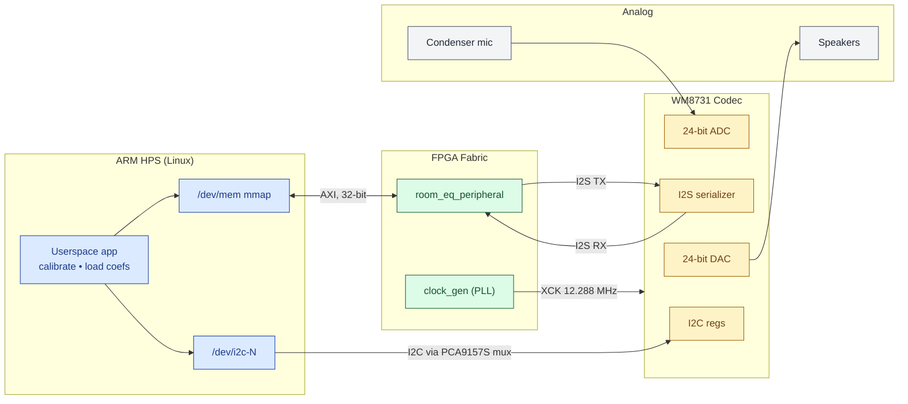
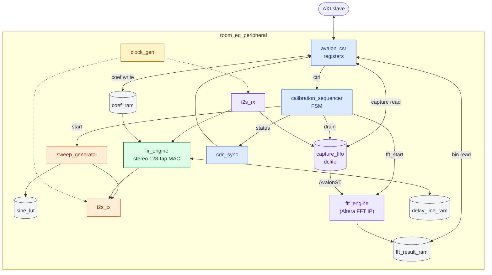
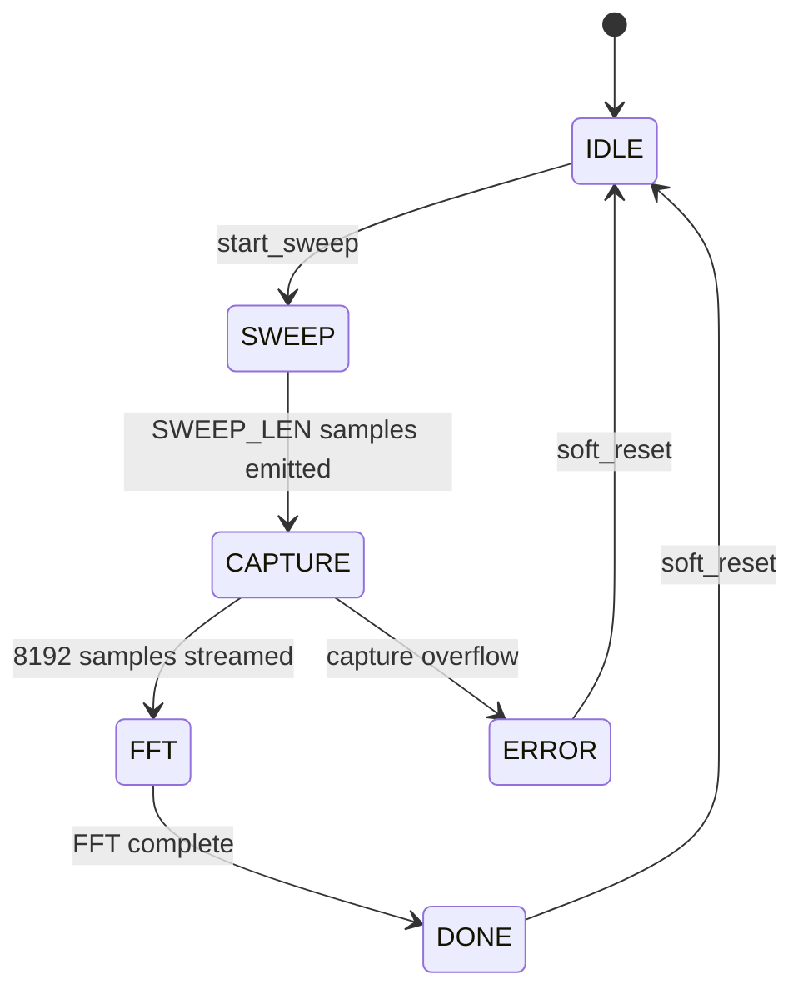

# Real-Time Room EQ Correction — Design Document

*Embedded Systems Project — DE1-SoC*
Jacob Boxerman (JIB2137) • Roland List (RJL2184) • Christian Scaff (CTS2148)
April 17, 2026

> **This document is a plan, not a spec.** The module decomposition, the top-level block diagram, the algorithms, and the big numeric commitments (48 kHz, 8192-pt FFT, 128 FIR taps, 24-bit audio) are stable. Everything more specific — register offsets, exact port widths, function signatures, file byte layouts — will evolve as we write the code. §8 tracks what's most likely to shift.

---

## 1. Introduction

Every listening room colors the sound played inside it: room modes boost or cancel specific frequencies, speaker placement tilts the stereo image, absorptive materials roll off highs. We are building a **closed-loop room-equalization device** on the DE1-SoC that measures a particular room's magnitude response, designs a compensating FIR filter, and applies that filter to audio in real time.

**How it works.** The user presses a button. The FPGA plays a 5-second logarithmic sine sweep (20 Hz – 20 kHz) out the LINE OUT jack. A microphone at the listening position captures the room's response via LINE IN. The FPGA buffers the captured samples and runs them through the Altera FFT IP core to produce a complex frequency-domain response `H(f)`. The ARM HPS reads those bins, computes the inverse target curve `C(f) = T(f) / H(f)` in software, synthesizes FIR taps via windowed IFFT, and writes them back to a coefficient RAM in the FPGA. From then on, a stereo FIR engine filters every audio sample in real time — the HPS is out of the audio path.

**Commitments.** 48 kHz sample rate, 24-bit audio, 8192-pt FFT, 128 stereo FIR taps in Q1.23 fixed-point. LINE IN for the microphone path. HPS handles codec initialization over I2C; FPGA handles everything sample-rate-bound.

**Scope.** Stereo playback correction from one listening position, offline calibration. Out of scope: multi-point averaging, subwoofer phase alignment, runtime adaptation.

**Glossary.** *I2S* — 3-wire serial audio bus (bit clock, left/right clock, data). *FIR* — finite impulse response filter; convolution against a tapped delay line. *BRAM* — on-chip FPGA block RAM. *AXI* — HPS ↔ FPGA bus. *Q1.23* — 24-bit signed fixed-point with 1 integer bit and 23 fractional bits.

---

## 2. System Block Diagram

The system has four domains: the ARM HPS (running Linux userspace), the FPGA fabric (all custom hardware), the on-board Wolfson WM8731 audio codec, and the analog path (speakers and microphone). The FPGA presents one custom peripheral — `room_eq_peripheral` — to the HPS. Everything the HPS does passes through that peripheral's register window over AXI; everything the codec does passes through I2S (audio) and I2C (control).

*(Source: [`assets/system_block.mmd`](assets/system_block.mmd).)*



**Connections worth calling out:**

- **HPS ↔ peripheral (AXI).** 32-bit register window mapped into the userspace app via `/dev/mem`. Every HPS-initiated action — trigger a sweep, poll for done, read an FFT bin, write a filter tap — is a 32-bit load or store against that window.
- **HPS → codec I2C.** Codec initialization (sample rate, word length, input routing) runs from userspace through the Linux `i2c-dev` driver, reaching the codec through the board's PCA9157S I2C multiplexer. The FPGA does not touch I2C.
- **Peripheral ↔ codec I2S.** The FPGA is the I2S master: it generates the bit clock (~3.07 MHz), the left/right frame clock (48 kHz), and the master clock XCK (12.288 MHz). Audio samples are 24-bit two's-complement, channels time-multiplexed in each frame.
- **Mic and speakers.** Condenser mic into LINE IN through an external preamp (the WM8731's on-chip mic preamp is noisy). Speakers on LINE OUT through a consumer amplifier.

**Clocks.**

| Clock     | Frequency    | Source              |
|-----------|--------------|---------------------|
| `sys_clk` | 50 MHz       | Board oscillator    |
| `xck`     | 12.288 MHz   | `clock_gen` PLL     |
| `bclk`    | 3.072 MHz    | Derived from XCK    |
| `lrck`    | 48 kHz       | Derived from BCLK   |

Clock-domain crossings use an Altera `dcfifo` (for the capture path) and 2-flip-flop synchronizers (for single-bit status). Details are implementation-time decisions, not design-time.

---

## 3. Custom Peripheral Architecture

`room_eq_peripheral` is one Platform Designer component written in Verilog. Internally it organizes around three data paths: the **sweep-out path** (HPS trigger → sweep generator → I2S TX), the **calibration path** (I2S RX → capture FIFO → FFT → result RAM → HPS read), and the **real-time audio path** (I2S RX → FIR → I2S TX). A `calibration_sequencer` FSM arbitrates during calibration and rests when the real-time path runs.

*(Source: [`assets/peripheral_internals.mmd`](assets/peripheral_internals.mmd). Blue = control, orange = sweep-out, purple = calibration, green = real-time audio, grey = memories.)*



### Calibration sequencer FSM

The FSM rests in `IDLE` during real-time playback. A sweep trigger runs through the measurement cycle exactly once and returns to `IDLE`.

*(Source: [`assets/calibration_fsm.mmd`](assets/calibration_fsm.mmd).)*



### Memories

| Memory           | Role                                  | Size (approx) |
|------------------|---------------------------------------|---------------|
| `sine_lut`       | Quarter-wave sine ROM for sweep gen   | ~16–72 Kbit   |
| `capture_fifo`   | Mic samples during sweep, 8192 × 24b  | ~192 Kbit     |
| `fft_result_ram` | 4097 complex bins from FFT IP         | ~192 Kbit     |
| `coef_ram`       | 128 taps × 24b × 2 ch                 | ~6 Kbit       |
| `delay_line_ram` | FIR delay line                        | ~6 Kbit       |
| FFT IP internal  | Twiddles + butterfly ping-pong        | ~50 Kbit      |
| **Total**        |                                       | **~470 Kbit** |

DE1-SoC has ~4,450 Kbit on-chip BRAM. We use around 10%.

### Bit widths

Audio samples are 24-bit signed (Q1.23 on the FIR path, plain PCM elsewhere). FFT bins are 24-bit real + 24-bit imaginary plus a shared 6-bit block exponent per FFT frame (block floating-point). The register bus is 32-bit AXI.

### Handshake

The data path that needs a real protocol is `capture_fifo → fft_engine`: AvalonST with `valid`/`ready` on both sides and `sop`/`eop` framing, so the FFT IP core sees a well-formed 8192-sample packet. Everything else — HPS coefficient writes, HPS bin reads — uses simple register-side-effect auto-increment pointers. Single-bit status (e.g., `sweep_done`) crosses clock domains through a 2-FF synchronizer.

---

## 4. Algorithms

### 4.1 Log sine sweep (FPGA)

A logarithmic sweep has instantaneous frequency `f(t) = f0 · (f1/f0)^(t/T)`. We implement it as a phase accumulator whose increment itself grows geometrically between samples:

```
# per sample, at 48 kHz, for 5 s:
phase_inc *= k           # k = exp(ln(f1/f0) / N), precomputed constant
phase     += phase_inc
idx        = phase[MSBs] # indexes quarter-wave sine_lut
emit sine_lut[idx] on DACDAT
```

### 4.2 Inverse-target FIR design (HPS)

After the FFT IP core fills `fft_result_ram`, the HPS reads the 4097 complex half-spectrum bins and designs a correction filter:

```python
H      = complex_bins * (2 ** bfp_exponent)   # undo BFP scaling
H_mag  = octave_smooth(abs(H), fraction=1/3)  # 1/3-octave smoothing
eps    = 1e-3 * H_mag.max()
C_mag  = TARGET / (H_mag + eps)               # design inverse
C_mag  = clip(C_mag, -12 dB, +12 dB)          # safety clamp
C_full = hermitian_extend(C_mag)              # build full spectrum
h      = real(ifft(C_full))                   # time-domain impulse response
h      = fftshift(h)                          # center the peak
taps   = h[mid-64 : mid+64] * hann(128)       # window + truncate
taps   = round(taps * 2**23)                  # scale to Q1.23
```

Why an IFFT? Because the FPGA applies correction as a 128-tap FIR in the time domain, and FIR taps are literally the filter's impulse response. `IFFT(C(f))` is that impulse response.

### 4.3 Real-time FIR convolution (FPGA)

Per sample, per channel: `y[n] = Σ h[k] · x[n-k]` for `k = 0..127`. We need 48000 × 128 × 2 ≈ 12.3 million MACs per second, which one pipelined DSP slice running at `sys_clk = 50 MHz` easily covers (128 cycles available between sample arrivals at 48 kHz). The delay line is a circular buffer indexed mod 128.

---

## 5. Resource Budget

| Resource       | Estimate   | Notes                                                      |
|----------------|------------|------------------------------------------------------------|
| BRAM           | ~470 Kbit  | ~10% of 4,450 Kbit on-chip. See §3 memory table.          |
| DSP blocks     | ~12        | FFT IP takes most; FIR pipeline uses 2–4; sweep uses 1–2. |
| LUTs           | ~15,000    | ~50% of DE1-SoC capacity. Rough estimate.                  |
| Flip-flops     | ~18,000    | Paired with LUT usage.                                     |
| PLLs           | 1          | `clock_gen`.                                               |
| HPS ↔ FPGA BW  | Low        | Few KB per calibration; zero during real-time playback.    |

After calibration completes, the real-time audio path runs entirely inside the FPGA and needs no HPS involvement.

---

## 6. Hardware / Software Interface

### 6.1 Register interface

The HPS reaches `room_eq_peripheral` through a memory-mapped 32-bit register window. We expect about a dozen registers falling into the following groups. Specific offsets and bit positions will be finalized in the Verilog — this table describes roles, not a fixed map.

| Group               | Registers                                        | Access | What it does |
|---------------------|--------------------------------------------------|--------|--------------|
| **Control**         | `CTRL`                                           | R/W    | Start sweep, enable FIR, soft reset, bypass. |
| **Status**          | `STATUS`, `IRQ_MASK`                             | R / R/W | `sweep_done`, `capture_overflow`, `fft_done`, `fir_ready`; optional interrupt enables. |
| **Sweep config**    | `SWEEP_LEN`                                      | R/W    | Sweep length in samples. |
| **Capture readout** | `CAPTURE_ADDR`, `CAPTURE_DATA`                   | R/W + R | HPS sets an index, reads raw captured samples. Read auto-increments the address. |
| **FFT readout**     | `FFT_ADDR`, `FFT_DATA_RE`, `FFT_DATA_IM`, `FFT_EXPONENT` | R/W + R | HPS sets a bin index, reads real/imag parts and the BFP exponent. |
| **Coef write-back** | `COEF_ADDR`, `COEF_DATA`                         | R/W + W | HPS sets a tap index, then streams 256 coefficient writes. |
| **Info**            | `VERSION`, `SAMPLE_RATE`, `TAP_COUNT`, `SCRATCH` | R / R/W | Build identification and bring-up debug. |

**Key side effects.** `CTRL.start_sweep` is write-one-to-pulse — it kicks the sequencer and self-clears. `CAPTURE_DATA` and `FFT_DATA_IM` reads auto-increment their address registers, so the driver can stream bins without explicit index management. `COEF_DATA` writes auto-increment `COEF_ADDR` so the driver can stream 256 taps sequentially.

### 6.2 Software driver

Userspace C code running on Linux opens `/dev/mem`, maps the peripheral's register window, and provides the following operations:

- **Initialize the codec** over I2C (sample rate, word length, input selection).
- **Trigger calibration** — one `CTRL` write.
- **Wait for completion** — poll `STATUS.fft_done` (or use an interrupt if wired).
- **Read the captured samples** (for debugging) and the FFT bins into HPS memory.
- **Design coefficients** — the inverse-target pipeline from §4.2, in Python or C depending on which is quicker to prototype.
- **Load coefficients** — stream 256 writes through `COEF_DATA`.
- **Enable the FIR** — set `CTRL.fir_enable`; the audio path comes alive.

We will ship a small `room_eq.h` header that defines register offsets, bit positions, and prototypes for the calibration flow. The specifics will be nailed down once the Verilog exists — the driver header is a thin wrapper over whatever the CSR module exposes.

### 6.3 Files

The calibration flow produces two files:

- **`sweep_capture.wav`** — the raw mic capture, saved as a standard WAV so we can open it in any audio tool for debugging.
- **`room_eq.coef`** — the 128 stereo FIR taps in Q1.23, small enough to inspect by hand. A short header names the sample rate, channel count, and tap count so future calibrations are self-describing. Exact byte layout finalized alongside the loader code.

---

## 7. Verilog Module Structure

The peripheral is a tree of modules rooted at `room_eq_peripheral`. Every module is authored in-house except `capture_fifo` (Altera `dcfifo`), the FFT core instance inside `fft_engine` (Altera FFT IP), and `clock_gen` (Altera PLL).

```
room_eq_peripheral
├── clock_gen                    PLL: 50 MHz → XCK/BCLK/LRCK
├── avalon_csr                   32-bit register file, AXI slave
├── calibration_sequencer        FSM that ordering sweep/capture/FFT
├── sweep_generator              phase-accumulator sweep source
│   └── sine_lut                 quarter-wave sine ROM
├── i2s_tx                       serializes samples to DACDAT
├── i2s_rx                       deserializes ADCDAT into samples
├── capture_fifo                 dual-clock FIFO for mic samples
├── fft_engine                   wraps the Altera FFT IP core
├── fft_result_ram               holds complex bins + BFP exponent
├── fir_engine                   stereo 128-tap real-time FIR
│   ├── coef_ram                 HPS-writable taps
│   └── delay_line_ram           circular sample buffer
└── cdc_sync                     instantiated once per status bit crossing
```

Every module has a small, obvious port set built around its role. For example, `sweep_generator` takes a `start` pulse and a length, emits a stream of 24-bit samples with a `valid` strobe, and raises `done` when finished; `fir_engine` takes stereo sample-in with `valid`, emits stereo sample-out with `valid`, and pulls taps from `coef_ram`. The exact port names and widths will be finalized when we write the Verilog — what matters at the design-doc stage is that each module has one clear job and that the streaming interfaces between them use the same `valid`/`ready` pattern everywhere.

---

## 8. Risks and Open Questions

- **The doc is deliberately loose in places.** Register offsets, exact port widths, C function signatures, and file byte layouts will shift during implementation. The stable commitments are: module decomposition, algorithm choices, numeric targets (48 kHz / 24-bit / 8192-pt FFT / 128 FIR taps / Q1.23), and the three top-level data paths.
- **Microphone not yet chosen.** We're committing to LINE IN with an external preamp for now. If we end up with an electret capsule and no preamp, we'll switch to the codec's MIC IN with its +20 dB boost and accept extra noise.
- **Altera FFT IP has real gotchas.** The block-floating-point exponent has to be applied in software before any magnitude math; input packet framing (`sop`/`eop`) has to be exact; output ordering (natural vs bit-reversed) is an IP-generation-time decision we'll lock in during implementation. We will bit-compare the IP output against numpy before trusting any correction filter it produces.
- **Filter-design heuristics need tuning.** The regularization ε, the ±12 dB clamp, and the 1/3-octave smoothing fraction are all starting points, not final values. We expect to adjust them based on listening tests.
- **Scope fallback: `fir_engine` is the last thing we build.** Measurement + coefficient design can ship on its own if the real-time FIR runs into schedule trouble. The peripheral separates the calibration path from the real-time path cleanly, so dropping `fir_engine` is a subtraction, not a refactor.
