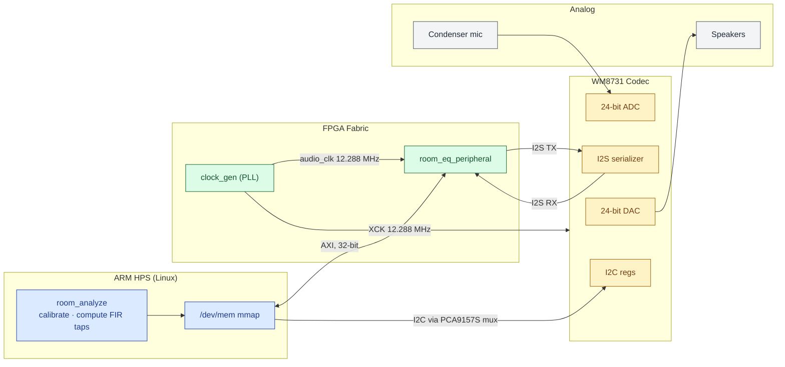
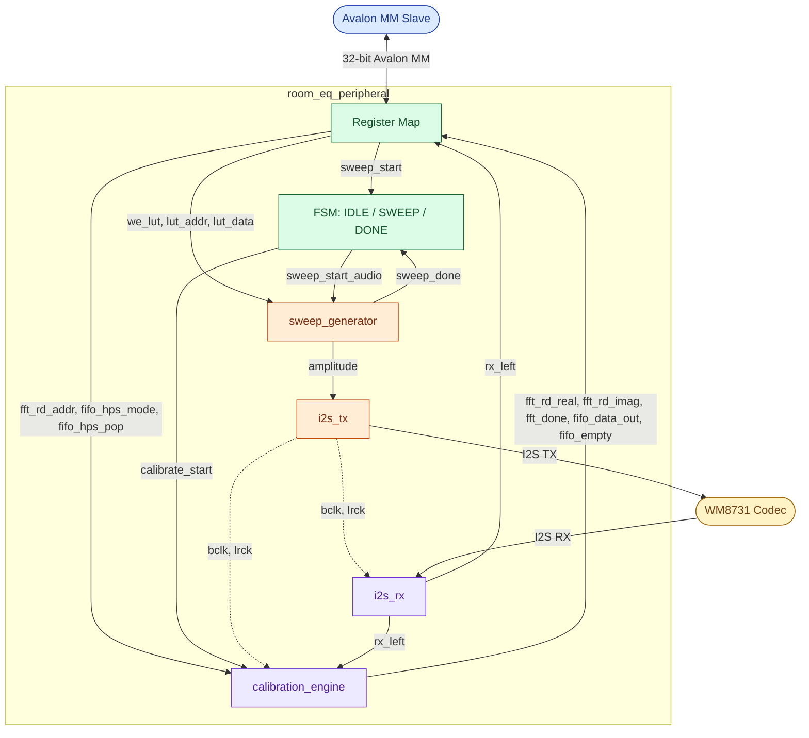
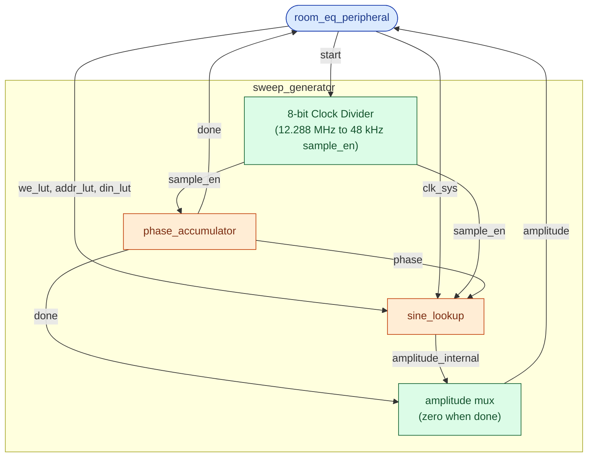
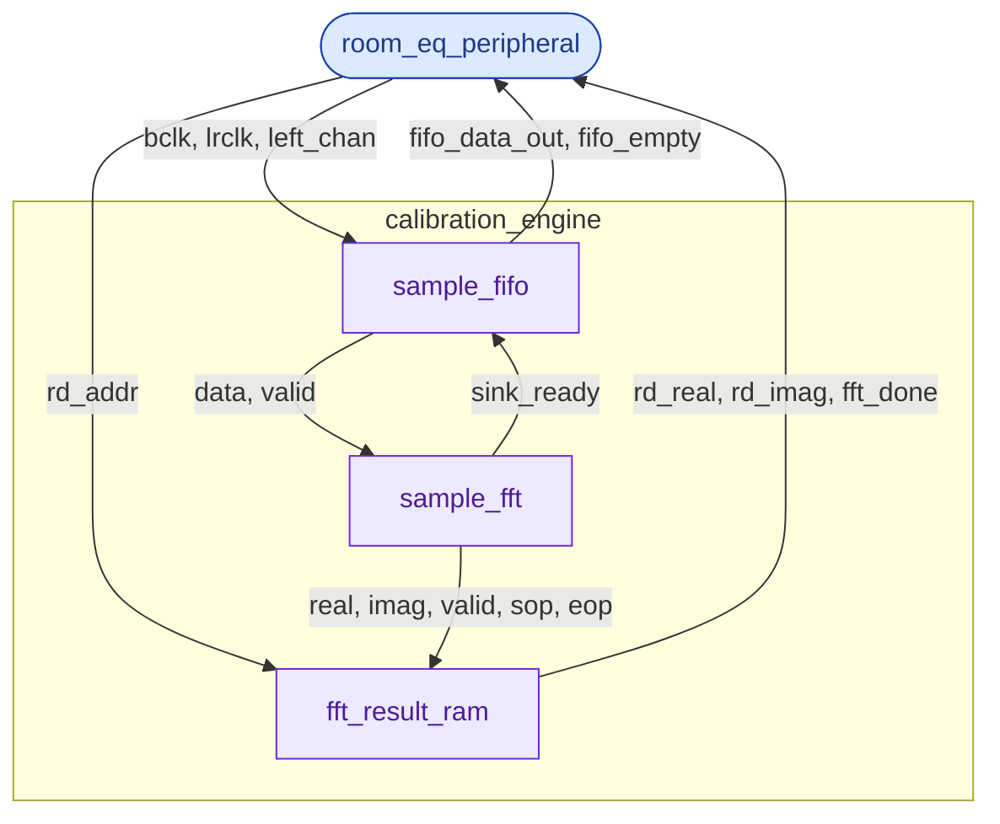
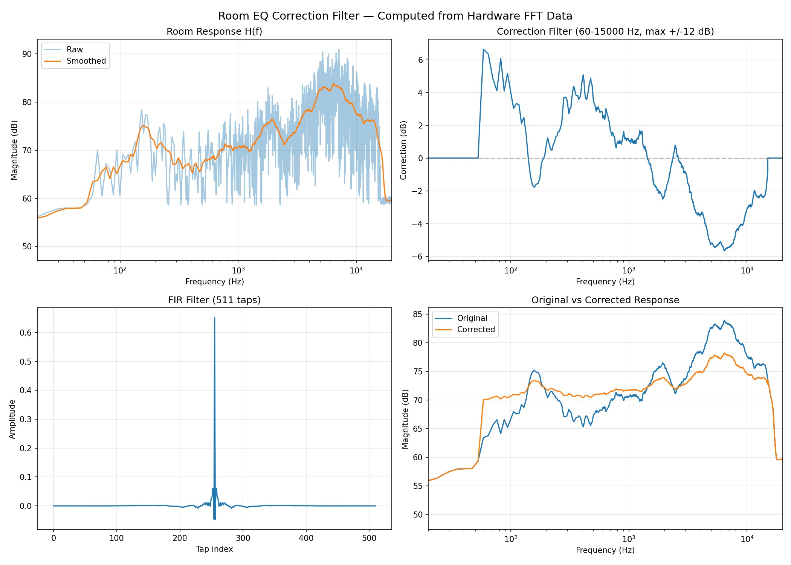

# CSEE 4840 Room EQ Correction Report

## 1. Introduction

Every listening room colors the sound played inside it: room modes boost or cancel specific frequencies, speaker placement tilts the stereo image, absorptive materials roll off highs. We propose to build a room-equalization device on the DE1-SoC that measures a particular room's magnitude response, designs a compensating FIR filter, and writes the resulting filter to a file for reuse.

The system operates in two phases. In the **measurement phase**, a logarithmic sine sweep from 60 Hz to 20 kHz is generated entirely in FPGA hardware and played through the WM8731 codec's DAC to the room speakers. The room's acoustic response is simultaneously captured by a condenser microphone through the codec's ADC. As samples arrive over I2S, a hardware calibration engine streams them into an 8192-point FFT running on the FPGA fabric, accumulating up to 64 frequency-domain frames. In the **analysis phase**, the ARM HPS reads the FFT bins over the lightweight HPS-to-FPGA bridge, computes a correction curve by inverting the measured response, and designs a linear-phase FIR filter via an inverse FFT. The resulting tap coefficients are written to a CSV file for downstream use.

Key hardware components include: a custom `room_eq_peripheral` Avalon MM slave integrating the sweep generator, I2S transmitter and receiver, and calibration engine; a Quartus PLL synthesizing the 12.288 MHz codec master clock; a 1024-entry quarter-wave sine LUT in BRAM initialized by the HPS at startup; a Quartus DCFIFO bridging the I2S bit-clock domain to the 50 MHz system clock; and a Quartus FFT II IP core performing the 8192-point transform. The HPS software (`room_analyze`) handles codec initialization over I2C, LUT loading, sweep triggering, frame capture, and all DSP post-processing using FFTW.

## 2. Hardware System Architecture



### Room EQ Peripheral

The Room EQ Peripheral is the top-level Avalon memory-mapped peripheral that integrates all hardware submodules. It exposes a 32-bit register interface to the HPS, manages a 3-state FSM controlling the sweep and capture flow, and bridges two clock domains — the 50 MHz system clock (`clk`) and the 12.288 MHz PLL audio clock (`audio_clk`) — with dedicated synchronizers. Audio conduit signals connect directly to the WM8731 codec pins on the DE1-SoC.



#### Interface

| Direction | Signal | Width | Description |
|-----------|--------|-------|-------------|
| Input | `clk` | 1 | 50 MHz system clock from Platform Designer |
| Input | `reset` | 1 | Active high system reset |
| Input | `writedata` | 32 | Data from HPS write |
| Output | `readdata` | 32 | Data returned to HPS on read |
| Input | `write` | 1 | Avalon write strobe |
| Input | `read` | 1 | Avalon read strobe |
| Input | `chipselect` | 1 | Peripheral select |
| Input | `address` | 4 | Register word offset (0–15) |
| Input | `audio_clk` | 1 | 12.288 MHz audio clock from PLL |
| Output | `AUD_XCK` | 1 | Master clock forwarded to codec |
| Output | `AUD_BCLK` | 1 | I2S bit clock to codec |
| Output | `AUD_DACDAT` | 1 | I2S DAC serial data to codec |
| Output | `AUD_DACLRCK` | 1 | I2S DAC frame clock to codec |
| Output | `AUD_ADCLRCK` | 1 | I2S ADC frame clock to codec (tied to `AUD_DACLRCK`) |
| Input | `AUD_ADCDAT` | 1 | I2S ADC serial data from codec |

#### Register Map

| Offset | Bits | Access | Name | Description |
|--------|------|--------|------|-------------|
| 0 | `[0]` | W | `CTRL` | `sweep_start` — one-cycle pulse to begin sweep; self-clears |
| 0 | `[1]` | R/W | `CTRL` | `fifo_hps_mode` — 1 = HPS drains FIFO directly, 0 = FFT drains |
| 1 | `[3:0]` | R | `STATUS` | FSM state — 0 = IDLE, 1 = SWEEP, 2 = DONE |
| 1 | `[4]` | R | `STATUS` | `fft_done` — high when FFT frame is complete and result RAM is valid |
| 1 | `[5]` | R | `STATUS` | `fifo_empty` — high when sample FIFO holds no data |
| 2 | — | — | — | Reserved |
| 3 | `[31:0]` | R | `VERSION` | Hardware version — reads `32'h0001_0000` |
| 4 | `[9:0]` | W | `LUT_ADDR` | Write address for sine LUT initialization (0–1023) |
| 5 | `[23:0]` | W | `LUT_DATA` | Write data for sine LUT — writing this register pulses `we_lut` |
| 6 | `[12:0]` | R/W | `FFT_ADDR` | Read address into FFT result RAM (0–8191) |
| 7 | `[23:0]` | R | `FFT_RDATA` | Real part of FFT bin at `FFT_ADDR` |
| 8 | `[23:0]` | R | `FFT_IDATA` | Imaginary part of FFT bin at `FFT_ADDR` |
| 9 | `[23:0]` | R | `ADC_LEFT` | Latest left-channel sample from I2S RX |
| 10 | `[23:0]` | R | `FIFO_RDATA` | Pop-on-read from sample FIFO (showahead) |

#### FSM

The peripheral contains a 3-state FSM clocked by `clk`.

| State | Description | Transitions |
|-------|-------------|-------------|
| `IDLE` | Waiting for HPS trigger | --> `SWEEP` on `sweep_start` write |
| `SWEEP` | Sweep active; calibration engine armed | --> `DONE` on rising edge of `sweep_done` (synchronized from audio domain) |
| `DONE` | FFT complete; result RAM available to HPS | --> `SWEEP` on `sweep_start` (allows re-trigger without full reset) |

On entering `SWEEP` from either `IDLE` or `DONE`, a one-cycle `calibrate_start` pulse is issued to arm the calibration engine's FFT pipeline.

#### Submodule Wiring

All submodules share `audio_clk` and a synchronized reset `sweep_reset` derived from the system `reset` via a 2-FF async-reset synchronizer in the audio domain.

`sweep_start` from the HPS (50 MHz domain) is transferred to the audio domain using a toggle synchronizer: the system clock toggles a flip-flop on each `sweep_start` pulse, and a 3-stage synchronizer in the audio domain detects the edge, producing a single-cycle `sweep_start_audio` pulse. `sweep_done` travels the other direction — a 2-FF synchronizer brings it from the audio domain back to `clk` for the FSM.

| Connection | From | To |
|------------|------|----|
| `amplitude` | `sweep_generator` | `i2s_tx` (both left and right channels) |
| `bclk_int`, `lrck_int` | `i2s_tx` | `i2s_rx`, `calibration_engine`, codec pins |
| `rx_left` | `i2s_rx` | `calibration_engine.left_chan` |
| `we_lut`, `lut_addr`, `lut_data` | Register write logic | `sweep_generator` |
| `fft_rd_addr` | Register write logic | `calibration_engine` |
| `fft_rd_real`, `fft_rd_imag` | `calibration_engine` | `readdata` (offsets 7, 8) |
| `fifo_data_out` | `calibration_engine` | `readdata` (offset 10), popped by `chipselect & read & address==10` |

### Clock Generator PLL

The Clock Generator PLL is a Quartus `altera_pll` IP core configured to synthesize a 12.288 MHz audio clock from the 50 MHz system reference clock. This frequency is the standard master clock for the WM8731 codec (256x oversampling at 48 kHz). All I2S and sweep generator logic is clocked from `outclk_0`.

#### Interface

| Direction | Signal | Width | Description |
|-----------|--------|-------|-------------|
| Input | `refclk` | 1 | 50 MHz system reference clock |
| Input | `rst` | 1 | Active-high reset |
| Output | `outclk_0` | 1 | 12.288 MHz audio clock output |
| Output | `locked` | 1 | High when PLL has achieved phase lock |

### Sweep Generator

The sweep generator module orchestrates the frequency sweep from 20 Hz to 20 KHz. On a start signal, the module resets and begins the sweep, outputting 24-bit signed sine values until 20 KHz is reached where a done signal is asserted. 



#### Interface

| Direction | Signal | Width | Description |
|-----------|--------|-------|-------------|
| Input | `clock` | 1 | 12.288 MHz PLL generated clock |
| Input | `reset` | 1 | Active high reset |
| Input | `clk_sys` | 1 | 50 MHz system clock, drives BRAM write port |
| Input | `we_lut` | 1 | Write enable (active high) — assert to write a sine value |
| Input | `addr_lut` | 10 | LUT write address (0–1023) |
| Input | `din_lut` | 24 | Signed sine value to store in LUT |
| Input | `start` | 1 | Trigger to start the sweep (requires 2-FF synchronizer — crosses clock domains) |
| Output | `amplitude` | 24 | Signed sine output for I2S TX |
| Output | `done` | 1 | Asserts and latches high when sweep reaches 20 kHz |

The sweep generator exposes the `addr_lut`, `din_lut`, and `we_lut` ports to the `sine_lookup` look up table (LUT). This allows the parent module to initialize the sine look up table with proper sine values prior to starting the sweep. The `sine_lookup` module is driven by a 50 MHz system clock `clk_sys`.

Upon `start` assertion, the module uses an internal 8-bit clock divider to convert the driving 12.288 MHz PLL clock to a 48 KHz sampling rate to drive the internal submodules `phase_accumulator` and `sine_lookup`.

The internal 32-bit phase signal is accumulated at increasing frequencies in the `phase_accumulator` module before being used to look up the associated sine amplitude value in `sine_lookup`. The resulting amplitude is outputted to the I2S TX module for transmission to the audio codec. When the sweep reaches 20 KHz, the amplitude cuts to 0 and a `done` signal is asserted.


*Sweep Generator — 8-bit clock divider driving phase_accumulator and sine_lookup, with LUT write port and amplitude/done outputs.*

### Phase Accumulator

The phase accumulator generates a 32-bit phase value that increases exponentially over time, driving the sine lookup with a continuously rising frequency. Starting at 20 Hz, the output frequency continuously doubles roughly, reaching 20 kHz after a 10-second sweep. When the upper frequency threshold is crossed, `done` latches high and accumulation stops.

#### Interface

| Direction | Signal | Width | Description |
|-----------|--------|-------|-------------|
| Input | `clock` | 1 | 12.288 MHz PLL generated clock |
| Input | `reset` | 1 | Active high reset — returns phase and increment to initial state |
| Input | `sample_en` | 1 | 48 kHz sample enable pulse, generated by the sweep generator clock divider |
| Output | `phase` | 32 | Current phase accumulator value, wraps naturally on overflow |
| Output | `done` | 1 | Latches high when the sweep reaches the 20 kHz threshold |

The accumulator maintains a 64-bit Q32.32 fixed-point register (`increment`) that tracks the instantaneous phase step per sample. On each `sample_en` pulse, two updates occur:

1. **Frequency growth** — the integer part of `increment` (`increment[63:32]`) is multiplied by the constant `K_FRAC = (K−1)×2^32`, where `K = exp(ln(1000) / (48000 × 10))`. Adding this product back to `increment` applies a per-sample exponential growth factor, producing a logarithmic (perceptually linear) frequency sweep.

2. **Phase accumulation** — the integer part of `increment` is added to the 32-bit `phase` register. Natural 32-bit overflow provides seamless phase wrapping with no additional logic.

On reset, `increment` is loaded with `INCREMENT_START = 1,789,570` (the Q32.32 encoding of the 20 Hz initial step size) and `phase` is cleared to zero. `done` is asserted and held once `increment[63:32]` reaches `INC_STOP = 1,789,569,707`, the threshold corresponding to a 20 kHz step size `(20000/48000) × 2^32`.


*Phase Accumulator — Q32.32 exponential sweep logic; increment register grows each sample until INC_STOP, asserting done.*

### Sine Lookup

The sine lookup module converts the 32-bit phase value from the phase accumulator into a 24-bit signed amplitude sample for the audio codec. To avoid staircase aliasing at high frequencies — where a large phase increment skips many LUT entries per sample — the module performs linear interpolation between adjacent entries using a 5-stage pipeline. A quarter-wave symmetry scheme means the underlying `sine_lut` BRAM only needs to store one quarter of a full sine period; the remaining three quadrants are reconstructed by mirroring the index and negating the output.

#### Interface

| Direction | Signal | Width | Description |
|-----------|--------|-------|-------------|
| Input | `clock` | 1 | 12.288 MHz PLL generated clock |
| Input | `reset` | 1 | Active high async reset |
| Input | `sample_en` | 1 | 48 kHz sample enable pulse from sweep generator |
| Input | `phase` | 32 | Current phase from phase accumulator |
| Input | `clk_sys` | 1 | 50 MHz system clock for LUT initialization |
| Input | `we_lut` | 1 | Write enable for LUT initialization |
| Input | `addr_lut` | 10 | Write address for LUT initialization (0–1023) |
| Input | `din_lut` | 24 | Sine value to write during LUT initialization |
| Output | `amplitude` | 24 | Interpolated, quadrant-corrected signed sine sample |

#### Phase Decomposition

The 32-bit phase word is split into three fields:

| Bits | Field | Purpose |
|------|-------|---------|
| `[31:30]` | `quadrant` | Selects which quarter-wave region (0–3) |
| `[29:20]` | `raw_index` | 10-bit integer LUT address within the quarter |
| `[19:10]` | `frac_bits` | 10-bit fractional position between two LUT entries |

In quadrants 1 and 3 the index is mirrored (`~raw_index`) to read the quarter-wave table in reverse, reconstructing the descending half of the sine. Quadrants 2 and 3 negate the interpolated result to produce the negative half-cycle.

#### Interpolation Pipeline

Each `sample_en` pulse advances a 5-state pipeline to produce one output sample:

| Cycle | Action |
|-------|--------|
| 0 | Present `index0` to BRAM read port; latch `quadrant`, `frac_bits`, `index1` |
| 1 | Wait — BRAM registers `mem[index0]` internally |
| 2 | Latch `val0 = lut_out`; present `index1` to BRAM read port |
| 3 | Wait — BRAM registers `mem[index1]` internally |
| 4 | Compute `interp = val0 + (lut_out − val0) * frac / 1024`; apply quadrant sign; output `amplitude` |

At 12.288 MHz with 256 clock cycles per 48 kHz sample period, the 5-cycle pipeline completes well before the next `sample_en` pulse.


*Sine Lookup — 5-stage interpolation pipeline; quadrant mirror logic and sine_lut BRAM read port.*

### Sine LUT

The sine LUT is a true dual-port block RAM storing 1024 entries of 24-bit signed sine values, representing one quarter-wave of a full sine period. Port A is write-only and driven by the 50 MHz system clock, used exclusively at startup to load pre-computed values from the HPS. Port B is read-only and driven by the 12.288 MHz audio clock, used by the `sine_lookup` interpolation pipeline during the sweep. The two ports operate in entirely separate clock domains; correct operation depends on all Port A writes completing before any Port B reads begin, which is guaranteed by system-level sequencing.

#### Interface

| Direction | Signal | Width | Clock Domain | Description |
|-----------|--------|-------|-------------|-------------|
| Input | `clk_a` | 1 | 50 MHz | Port A write clock |
| Input | `we_a` | 1 | `clk_a` | Write enable — high to write `din_a` into `mem[addr_a]` |
| Input | `addr_a` | 10 | `clk_a` | Write address (0–1023) |
| Input | `din_a` | 24 | `clk_a` | Signed sine value to store |
| Input | `clk_b` | 1 | 12.288 MHz | Port B read clock |
| Input | `addr_b` | 10 | `clk_b` | Read address driven by `sine_lookup` pipeline |
| Output | `dout_b` | 24 | `clk_b` | Sine value at `mem[addr_b]`, registered — valid 1 cycle after `addr_b` |

#### Port A — Write

On each rising edge of `clk_a`, if `we_a` is high, `din_a` is written into `mem[addr_a]`. No read capability exists on Port A.

#### Port B — Read

On each rising edge of `clk_b`, `dout_b` is registered from `mem[addr_b]`, giving a one-cycle read latency. The `sine_lookup` pipeline accounts for this latency with its explicit wait states at pipeline stages 1 and 3.


*Sine LUT — true dual-port 1024×24-bit BRAM; port A write at 50 MHz, port B read at 12.288 MHz.*

### Calibration Engine

The calibration engine captures the room's acoustic response by recording the microphone signal during a frequency sweep, streaming the samples through an FFT, and storing the resulting frequency-domain bins in a dual-port RAM for the HPS to read. It bridges two clock domains — the I2S bit clock (`bclk`) and the 50 MHz system clock (`sysclk`) — using a sample FIFO, and supports two drain modes: automatic FFT processing or direct HPS readout.



#### Interface

| Direction | Signal | Width | Description |
|-----------|--------|-------|-------------|
| Input | `sysclk` | 1 | 50 MHz system clock |
| Input | `bclk` | 1 | I2S bit clock |
| Input | `lrclk` | 1 | I2S left-right clock |
| Input | `aclr` | 1 | Active high async reset (spans both clock domains) |
| Input | `start` | 1 | One-cycle pulse to begin feeding samples into the FFT pipeline |
| Input | `left_chan` | 24 | 24-bit I2S serial audio data (left channel) |
| Input | `rd_addr` | 13 | RAM read address for HPS to retrieve FFT bins (0–8191) |
| Input | `fifo_hps_mode` | 1 | When high, HPS drains the sample FIFO directly instead of the FFT |
| Input | `fifo_hps_pop` | 1 | One-cycle pop pulse from HPS in `fifo_hps_mode` |
| Output | `rd_real` | 24 | Real part of FFT bin at `rd_addr` |
| Output | `rd_imag` | 24 | Imaginary part of FFT bin at `rd_addr` |
| Output | `fft_done` | 1 | Asserts when FFT processing is complete and RAM is ready to read |
| Output | `fifo_data_out` | 24 | Head of the sample FIFO (showahead — valid whenever `fifo_empty` is low) |
| Output | `fifo_data_valid` | 1 | High when the FIFO contains at least one sample |
| Output | `fifo_empty` | 1 | High when the FIFO is empty |

#### Submodules

The calibration engine composes three submodules in a linear pipeline:

| Submodule | Function |
|-----------|----------|
| `sample_fifo` | Captures incoming I2S samples on `bclk`/`lrclk` and crosses them into the `sysclk` domain via an async FIFO |
| `sample_fft` | Altera FFT IP core — consumes samples via an AXI-ST `sink` interface and produces complex bins on a `source` interface |
| `fft_result_ram` | Accepts FFT output bins and writes them into a dual-port RAM; asserts `fft_done` on end-of-packet |

#### Data Flow

On `start`, a `running` latch arms the FFT input gate. Samples arriving from `sample_fifo` are gated by `running & ~fifo_hps_mode` before being presented to `sample_fft`. This prevents the FFT from consuming stale samples before a sweep begins, and allows the HPS to inspect raw samples directly when `fifo_hps_mode` is asserted.

A consumer MUX on the FIFO read port selects between two drain paths: `fft_to_fifo_ready` (backpressure from the FFT core) in normal mode, or `fifo_hps_pop` (one-cycle pulses from the HPS) in HPS mode. The reset path uses a 2-FF synchronizer on `sysclk` to derive `reset_n` from the async `aclr`, ensuring a glitch-free active-low reset for the FFT IP core.


*Calibration Engine — CDC bridge from audio domain; sample_fifo, sample_fft, and fft_result_ram pipeline with HPS read mux.*

### Sample FIFO

The sample FIFO captures incoming I2S audio samples on the bit clock domain and makes them available to the FFT pipeline on the 50 MHz system clock domain. It wraps a Quartus-generated dual-clock FIFO (`capture_fifo`) with write and read request logic, using the falling edge of `lrclk` to clock in one 24-bit sample per stereo frame and backpressure from the FFT consumer to control the read side.

#### Interface

| Direction | Signal | Width | Description |
|-----------|--------|-------|-------------|
| Input | `bclk` | 1 | I2S bit clock (3.072 MHz) — write clock domain |
| Input | `lrclk` | 1 | I2S left-right clock (48 kHz) — used to detect new sample boundaries |
| Input | `left_chan` | 24 | 24-bit I2S audio sample (left channel) |
| Input | `sysclk` | 1 | 50 MHz system clock — read clock domain |
| Input | `aclr` | 1 | Active high async reset |
| Input | `fft_ready` | 1 | Backpressure signal from FFT — high when FFT can accept a sample |
| Output | `data_out` | 24 | 24-bit audio sample at the head of the FIFO |
| Output | `data_valid` | 1 | High when the FIFO is non-empty and `data_out` is valid |

#### Write Logic

A falling edge detector on `lrclk` (registered on `bclk`) produces a one-cycle `lrclk_neg_edge` pulse once per 48 kHz frame, marking the boundary of a new left-channel sample. A write request (`wrreq`) is asserted on that pulse only if the FIFO is not full (`~wrfull`), preventing overflow drops.

#### Read Logic

The read side is entirely driven by backpressure. `data_valid` is the logical inverse of `rdempty` — it is high whenever the FIFO holds at least one sample. A read request (`rdreq`) fires only when both `data_valid` and `fft_ready` are high, so the FIFO stalls automatically when the downstream FFT core is not ready to consume.

#### Clock Domain Crossing

The underlying `capture_fifo` is a Quartus DCFIFO primitive with `bclk` as the write clock and `sysclk` as the read clock. All gray-code pointer synchronization is handled internally by the IP, so no additional CDC logic is required in this module.


*Sample FIFO — wraps Quartus DCFIFO; write on lrclk falling edge (bclk domain), read driven by FFT backpressure or HPS pop (sysclk domain).*

### Sample FFT

The sample FFT module wraps a Quartus-generated 8192-point forward FFT IP core (`capture_fft`) with the SOP/EOP framing logic required by its variable-streaming interface. It accepts a stream of real-valued 24-bit audio samples from the sample FIFO and produces a stream of complex 24-bit frequency-domain bins. The imaginary input is tied to zero since all incoming samples are real.

#### Interface

| Direction | Signal | Width | Description |
|-----------|--------|-------|-------------|
| Input | `sysclk` | 1 | 50 MHz system clock |
| Input | `reset_n` | 1 | Active low reset |
| Input | `sink_real` | 24 | Real part of input sample from FIFO |
| Input | `sink_valid` | 1 | High when input sample is valid and ready to be consumed |
| Output | `sink_ready` | 1 | Backpressure from FFT core — high when the core can accept a sample |
| Output | `source_real` | 24 | Real part of FFT output bin |
| Output | `source_imag` | 24 | Imaginary part of FFT output bin |
| Output | `source_valid` | 1 | High when the output bin is valid |
| Output | `source_sop` | 1 | Start of packet — asserts on the first bin of each FFT frame |
| Output | `source_eop` | 1 | End of packet — asserts on the last bin of each FFT frame |

#### SOP/EOP Framing

The Quartus FFT IP selected uses a variable-streaming interface that requires explicit start-of-packet and end-of-packet signals on the sink side to delimit each 8192-sample frame. A 13-bit counter (`sample_count`) tracks the number of samples consumed by the core, incrementing on every valid handshake (`sink_valid & sink_ready`) and wrapping at 8191.

- `sink_sop` asserts when `sample_count == 0` (first sample of the frame)
- `sink_eop` asserts when `sample_count == 8191` (last sample of the frame)

#### Fixed Configuration

Several inputs to the underlying IP are tied to constants in this module:

| Signal | Value | Reason |
|--------|-------|--------|
| `fftpts_in` | 8192 | Fixed 8192-point transform |
| `inverse` | 0 | Forward FFT only — IFFT not used |
| `sink_imag` | 0 | Real-only input; no imaginary component |
| `source_ready` | 1 | Downstream RAM never stalls — no backpressure needed |
| `sink_error` | 0 | Error injection not used |

The core is instantiated as bidirectional (FFT + IFFT) solely because Quartus requires the bidirectional variant to support variable streaming with fixed-point precision. Only the forward direction is exercised.


*Sample FFT — wraps Quartus 8192-point FFT IP; 13-bit sample counter generates SOP/EOP framing for variable streaming.*

### FFT Result RAM

The FFT result RAM receives the complex frequency-domain bins from the FFT core and stores them in two 8192-entry 24-bit arrays — one for real parts, one for imaginary parts. Only 4097 entries are used per array. However, a 23-bit array is insufficient for such size. A sequential write pointer traverses the arrays as valid bins arrive, and `fft_done` latches high on the end-of-packet signal to notify the HPS that the full frame is ready. The HPS then reads any bin by supplying a 13-bit address, with a one-cycle read latency.

#### Interface

| Direction | Signal | Width | Description |
|-----------|--------|-------|-------------|
| Input | `sysclk` | 1 | 50 MHz system clock |
| Input | `reset_n` | 1 | Active low reset |
| Input | `fft_real` | 24 | Real part of incoming FFT bin |
| Input | `fft_imag` | 24 | Imaginary part of incoming FFT bin |
| Input | `fft_valid` | 1 | High when the current bin is valid (Avalon-ST) |
| Input | `data_sop` | 1 | Start of packet — marks the first bin of the FFT frame |
| Input | `data_eop` | 1 | End of packet — marks the last bin of the FFT frame |
| Input | `rd_addr` | 13 | Read address from HPS (0–8191) |
| Output | `rd_real` | 24 | Real part of stored bin at `rd_addr` (1-cycle latency) |
| Output | `rd_imag` | 24 | Imaginary part of stored bin at `rd_addr` (1-cycle latency) |
| Output | `fft_done` | 1 | Latches high when the full 8192-bin frame has been stored |

#### Write Logic

Bins are written only when `fft_valid` is high. On `data_sop`, the write pointer resets to zero, the first bin is stored at address 0, `fft_done` is cleared, and the pointer advances to 1. On each subsequent valid cycle the bin is stored at the current pointer address and the pointer increments. When `data_eop` arrives coincident with `fft_valid`, `fft_done` latches high, signalling the HPS that the RAM holds a complete spectrum.

#### Read Logic

Reads are synchronous with a one-cycle latency: `rd_real` and `rd_imag` reflect `ram_real[rd_addr]` and `ram_imag[rd_addr]` on the clock edge following the address being presented.


*FFT Result RAM — dual 8192×24-bit BRAMs storing real and imaginary FFT output; write pointer resets on SOP, fft_done latches on EOP.*

### I2S Transmitter

The I2S transmitter serializes stereo 24-bit parallel audio samples to the WM8731 codec using the standard Philips I2S format — MSB-first, 24 data bits followed by 8 padding bits per channel, with a 1-bit delay relative to the `lrck` frame boundary. The module runs entirely in the 12.288 MHz clock domain; `bclk` and `lrck` are data outputs driven by the module.

#### Interface

| Direction | Signal | Width | Description |
|-----------|--------|-------|-------------|
| Input | `clock` | 1 | 12.288 MHz master clock from PLL |
| Input | `reset` | 1 | Active high synchronous reset |
| Input | `left_sample` | 24 | Signed 24-bit left channel audio sample |
| Input | `right_sample` | 24 | Signed 24-bit right channel audio sample |
| Output | `bclk` | 1 | 3.072 MHz bit clock --> codec `AUD_BCLK` |
| Output | `lrck` | 1 | 48 kHz frame clock --> codec `AUD_DACLRCK` |
| Output | `dacdat` | 1 | Serial data --> codec `AUD_DACDAT` |

#### Submodules

| Submodule | Function |
|-----------|----------|
| `i2s_clock_gen` | Divides the 12.288 MHz master clock to generate `bclk` (3.072 MHz) and `lrck` (48 kHz), along with a `bclk_fall` strobe and a 6-bit `bit_cnt` (0–63) that tracks position within each 64-cycle stereo frame |
| `i2s_shift_register` | 24-bit parallel-load shift register that serializes one channel's sample MSB-first onto `dacdat` |

#### Data Flow

Both input samples are latched into hold registers two bit-clock cycles before the end of each frame (`bit_cnt == 62`), ensuring the inputs are stable before the upcoming load. The shift register is then loaded with the left channel at `bit_cnt == 63` and with the right channel at `bit_cnt == 31`. On all other falling `bclk` edges — except the two delay slots at `bit_cnt == 0` and `bit_cnt == 32` — the shift register shifts by one, advancing the next data bit onto `dacdat`. The two delay slots implement the 1-bit I2S framing delay, holding the MSB on the output for an extra cycle after each channel load before shifting begins.


*I2S Transmitter — i2s_clock_gen drives bclk/lrck timing; i2s_shift_register serializes left and right 24-bit samples with 1-bit framing delay.*

### I2S Clock Generator

The I2S clock generator derives a bit clock `BCLK` and frame clock `LRCK` from the 12.288 MHz system clock. These are outputted as data signals within the system clock domain.

#### Interface

| Direction | Signal | Width | Description |
|-----------|--------|-------|-------------|
| Input | `clock` | 1 | 12.288 MHz master clock from PLL |
| Input | `reset` | 1 | Active high synchronous reset |
| Output | `bclk` | 1 | 3.072 MHz bit clock (12.288 MHz / 4) --> codec `AUD_BCLK` |
| Output | `lrck` | 1 | 48 kHz frame clock (`bclk` / 64) — low = left channel, high = right channel --> codec `AUD_DACLRCK` |
| Output | `bclk_fall` | 1 | One-cycle strobe that fires one master-clock cycle before `bclk` falls; used by `i2s_tx` to time data shifts |
| Output | `bit_cnt` | 6 | Position within the current 64-bit I2S frame (0–63); increments on each `bclk_fall` and wraps naturally |


*I2S Clock Generator — 2-bit bclk_cnt divides 12.288 MHz by 4 to produce 3.072 MHz bclk; bit_cnt[5] drives lrck.*

### I2S Shift Register

Parallel-to-serial shift register for I2S data transmission. Loads a 24-bit sample and shifts it out MSB-first, one bit per shift pulse.  After 24 shifts, zeros pad the output.

#### Interface

| Direction | Signal | Width | Description |
|-----------|--------|-------|-------------|
| Input | `clock` | 1 | 12.288 MHz master clock |
| Input | `reset` | 1 | Active high synchronous reset — clears shift register to zero |
| Input | `data_in` | 24 | Parallel data to load |
| Input | `load` | 1 | One-cycle pulse — loads `data_in`; takes priority over `shift` |
| Input | `shift` | 1 | One-cycle pulse — shifts register left by 1, zero-fills LSB |
| Output | `serial_out` | 1 | MSB of shift register (combinational) |


*I2S Shift Register — parallel-load shift register; load has priority over shift, serial_out is combinational MSB.*

### I2S RX

This I2S receiver module deserializes stereo 24-bit audio from the WM8731 codec. It expects Philips I2S format: 1-bit delay, MSB-first, with 24 bits of data and 8 garbage bits per channel.

`bclk` and `lrck` are shared with the I2S transmitter and treated as data signals in the 12.288 MHz clock domain. The receiver derives rising and falling edge strobes from `bclk` by registering it against the master clock. A 6-bit `bit_cnt` mirrors the transmitter's counter, incrementing on each `bclk` falling edge. Serial data on `adcdat` is sampled on `bclk` rising edges: the left channel occupies `bit_cnt` 1–24 (one cycle after `lrck` falls, per the 1-bit I2S delay) and the right channel occupies `bit_cnt` 33–56. Each channel is shifted MSB-first into a 24-bit accumulator and latched into the output register on its final bit.

#### Interface

| Direction | Signal | Width | Description |
|-----------|--------|-------|-------------|
| Input | `clock` | 1 | 12.288 MHz master clock |
| Input | `reset` | 1 | Active high synchronous reset |
| Input | `bclk` | 1 | 3.072 MHz bit clock from `i2s_tx` — sampled as data |
| Input | `lrck` | 1 | 48 kHz frame clock from `i2s_tx` — low = left channel, high = right channel |
| Input | `adcdat` | 1 | Serial ADC data from codec (`AUD_ADCDAT`) |
| Output | `left_sample` | 24 | Deserialized left channel sample, updated once per frame |
| Output | `right_sample` | 24 | Deserialized right channel sample, updated once per frame |


*I2S Receiver — deserializes WM8731 ADC output; bclk/lrck treated as data inputs, samples captured on detected rising edges.*

## 2. Resource Utilization

The following utilization figures are from the last successful Quartus compile targeting the De1 SoC Cyclone V.

| Resource | Used | Total | Utilization |
|----------|------|-------|-------------|
| Logic (ALMs) | 5,912 | 32,070 | 18% |
| Registers | 12,607 | — | — |
| Pins | 362 | 457 | 79% |
| Block memory bits | 1,557,532 | 4,065,280 | 38% |
| RAM Blocks | 222 | 397 | 56% |
| DSP Blocks | 21 | 87 | 24% |
| PLLs | 1 | 6 | 17% |
| DLLs | 1 | 4 | 25% |

Logic is comfortable at 18%. RAM blocks at 56% is the highest pressure resource, driven primarily by the FFT IP core and the dual 8192-entry result RAM. Pins are at 79% — the design cannot accommodate significantly more I/O without pin budget constraints.

## 3. Software System Architecture

### HPS–FPGA Interface

The software accesses all FPGA peripherals through the lightweight HPS-to-FPGA bridge, mapped into the HPS virtual address space using `/dev/mem`. At startup, `main` opens `/dev/mem` and calls `mmap` to map a 2 MB window starting at physical address `0xFF200000` (`LW_BRIDGE_BASE`) into process memory. Two typed pointers are then derived from this window:

| Pointer | Offset | Physical Base | Target |
|---------|--------|---------------|--------|
| `i2c_base` | `0x0000` | `0xFF200000` | Altera soft I2C master (codec control) |
| `room_eq_base` | `0x2000` | `0xFF202000` | Room EQ peripheral register bank |

All peripheral reads and writes are 32-bit word accesses through `volatile uint32_t *` pointers — no kernel driver is used. We attempted to build a kernel module based on lab three, however, were unable to get the device tree set up properly. We fell back on this design, trading off security for simplicity.

#### Room EQ Register Access

`room_eq_base` is indexed by word offset, matching the hardware register map:

| Offset | Name | Direction | Usage in software |
|--------|------|-----------|-------------------|
| 0 | `CTRL` | W | Write `(1 << 0)` to pulse `sweep_start` |
| 1 | `STATUS` | R | Poll `[3:0]` for FSM state (2 = DONE), `[4]` for `fft_done` |
| 4 | `LUT_ADDR` | W | Write sine LUT address (0–1023) before each `LUT_DATA` write |
| 5 | `LUT_DATA` | W | Write 24-bit sine sample; hardware pulses `we_lut` on each write |
| 6 | `FFT_ADDR` | W | Set bin index (0–4096) before reading result |
| 7 | `FFT_RDATA` | R | Read real part of FFT bin at `FFT_ADDR` |
| 8 | `FFT_IDATA` | R | Read imaginary part of FFT bin at `FFT_ADDR` |

#### I2C / WM8731 Register Access

`i2c_base` exposes the Altera I2C master's control registers. The software programs the codec over I2C by writing to `I2C_TFR_CMD` (`+0x00`) with start/stop control bits, reading `I2C_STATUS` (`+0x14`) to poll for idle, and checking `I2C_ISR` (`+0x10`) for NACK errors. The WM8731 7-bit I2C address is `0x1A`.

### Algorithmic Pipeline

The program executes the following stages in order.

**1. Hardware Setup** (`main` → `hw_codec_init`)

`/dev/mem` is opened and a 2 MB window is mapped. The Altera I2C master is configured (SCL period 500 ns), and 10 WM8731 registers are written over I2C to power up the codec, configure input gain (mic or line-in), enable DAC and ADC, set 24-bit I2S mode, and activate the digital core. This must complete before any audio signal is valid.

**2. Sine LUT Load** (`load_sine_lut`)

1024 quarter-wave samples are computed on the HPS as `sin(i * π / 2048) * 8388607` (scaled to 24-bit signed) and written to the FPGA sine LUT one entry at a time via `LUT_ADDR_REG` / `LUT_DATA_REG`. This initializes the sweep generator's BRAM before the sweep starts.

**3. Sweep and FFT Capture** (`capture_sweep`)

`CTRL_REG` is written with `sweep_start` (bit 0). The software then polls `STATUS_REG` in a tight loop. Each time bit 4 (`fft_done`) goes high, it reads all 4097 bins (`FFT_SIZE/2 + 1`) by writing `FFT_ADDR_REG` and reading `FFT_RDATA_REG` / `FFT_IDATA_REG` for each bin, storing the 24-bit sign-extended values into `frame_real[n]` / `frame_imag[n]`. After consuming a frame it waits for `fft_done` to deassert before continuing. The loop exits when `STATUS[3:0]` reaches `STATE_DONE` (2). Up to 64 frames are captured.

**4. Room Response Computation** (`compute_room_response`)

For each frequency bin, the peak magnitude across all captured frames is selected: `max(sqrt(re² + im²))`. Bins are then scaled by `freq_hz / 1000` to compensate for the 1/f energy distribution of a logarithmic sweep. The resulting spectrum is smoothed with a proportional-bandwidth (10%) sliding window to reduce noise before subsequent stages.

```
for each bin b in 0..BINS_PER_FRAME:
    H_mag[b] = max over all frames of sqrt(re² + im²)
    H_mag[b] *= (b * 48000/8192) / 1000.0   // 1/f compensation

for each bin b:
    H_smooth[b] = average of H_mag[b-w .. b+w]  // w = max(1, b * 0.10)
```

**5. Correction Curve Computation** (`compute_correction`)

The mean level of the smoothed response is computed over the target correction range (default 60 Hz – 20 kHz). Each bin's correction gain is set to the inverse of its normalized response (`1 / H_norm`), clamped to ±`max_db` (default ±12 dB), then blended toward unity by `strength` (default 0.5): `c = 1 + strength * (c - 1)`. Bins outside the correction range are set to unity gain.

```
H_mean = average of H_smooth[lo_bin .. hi_bin]

for each bin b in lo_bin..hi_bin:
    H_norm = H_smooth[b] / H_mean
    c = 1.0 / H_norm                     // invert room response
    c = clamp(c, 10^(-max_db/20), 10^(max_db/20))
    c = 1.0 + strength * (c - 1.0)       // blend toward unity
    correction[b] = c

// bins outside [lo_bin, hi_bin] remain 1.0
```

**6. FIR Tap Computation** (`compute_fir_taps`)

The correction gain array (real-valued, one entry per bin) is treated as a half-complex frequency-domain spectrum and transformed to the time domain with FFTW's `c2r` inverse FFT. The center `n_taps` samples (default 511) are extracted from the wrap-around impulse response, multiplied by a Hanning window, and normalized so the DC gain equals 1. The result is a linear-phase FIR filter whose frequency response approximates the target correction curve.

```
freq_buf[b] = correction[b] + 0j   // for b in 0..BINS_PER_FRAME

time_buf = IFFT(freq_buf)           // FFTW c2r, length 8192

// unwrap wrap-around order into linear-phase center
taps[0..half-1]  = time_buf[8192-half .. 8191] / 8192
taps[half..n-1]  = time_buf[0 .. half]         / 8192

// Hanning window
taps[i] *= 0.5 * (1 - cos(2π*i / (n_taps-1)))

// normalize DC gain to 1
taps /= sum(taps)
```

**7. Output**

The `n_taps` tap coefficients are written one per line to a CSV file (default `correction_taps.csv`). A terminal frequency-response graph (32 log-spaced rows, 50-character bars) and a room analysis report listing peaks, dips, and standard deviation are printed to stdout.

## 4. Demo

The figure below shows a complete sample run of the system on a real room.



The top-left panel shows the raw and smoothed room response (55–85 dB, 60 Hz–20 kHz), revealing a broad peak in the 3–10 kHz range. The top-right panel shows the resulting correction curve, boosting low frequencies by up to +6.5 dB and attenuating the high-frequency peak by up to −6 dB, clamped to ±12 dB. The bottom-left panel shows the 511-tap Hanning-windowed FIR impulse response, symmetric about tap 256. The bottom-right panel overlays the original and corrected responses, confirming a noticeably flatter magnitude across the full band.

## 5. Project Roles and Lessons

### Jacob Boxerman

### Roland List

### Christian Scaff

## 6. Source Code

```
Embedded-Real-Time-Room-EQ-Correction/
├── src/
│   ├── hardware/
│   │   ├── memory/
│   │   │   ├── sine_lut.sv                        # 1024×24-bit quarter-wave BRAM (dual-port)
│   │   │   └── fft_results_ram.sv                 # 8192×24-bit dual BRAM (real + imag)
│   │   └── room_eq_peripheral/
│   │       ├── room_eq_peripheral.sv              # Top-level Avalon MM peripheral + FSM
│   │       ├── sweep_generator/
│   │       │   ├── sweep_generator.sv             # Clock divider, sweep control
│   │       │   ├── phase_accumulator.sv           # Q32.32 exponential frequency ramp
│   │       │   └── sine_lookup.sv                 # 5-stage interpolation pipeline
│   │       ├── i2s_tx/
│   │       │   ├── i2s_tx.sv                      # I2S transmitter (top)
│   │       │   ├── i2s_clock_gen.sv               # bclk / lrck dividers
│   │       │   └── i2s_shift_register.sv          # Parallel-to-serial shift register
│   │       ├── i2s_rx/
│   │       │   └── i2s_rx.sv                      # I2S receiver (deserializer)
│   │       └── calibration_engine/
│   │           ├── calibration_engine.sv          # FIFO + FFT + RAM pipeline
│   │           ├── sample_fifo.sv                 # bclk→sysclk DCFIFO wrapper
│   │           └── sample_fft.sv                  # 8192-pt FFT IP wrapper (SOP/EOP)
│   └── software/
│       └── room_eq/
│           ├── room_analyze.c                     # HPS: sweep, capture, correction, FIR
│           └── Makefile
└── lab3-hw/
    ├── soc_system_top.sv                          # FPGA top-level (pin mapping)
    ├── soc_system.qsys                            # Platform Designer system
    ├── soc_system.qsf                             # Quartus pin assignments
    ├── room_eq_peripheral_hw.tcl                  # Platform Designer component definition
```

### room_analyze.c

```C
/*
 * room_analyze.c — Room EQ analysis and correction filter computation
 *
 * Runs on the DE1-SoC HPS. Performs a calibration sweep, captures FFT
 * frames from the FPGA, extracts the room response H(f), computes a
 * correction FIR filter, and prints a room analysis report with a
 * terminal frequency response graph.
 *
 * Usage:
 *   ./room_analyze [options]
 *     -L          Use line-in instead of mic
 *     -B          No mic boost
 *     -f FILE     Read sweep data from CSV file instead of running sweep
 *     -o FILE     Write correction taps to file (default: correction_taps.csv)
 *     -e FREQ     Analysis end frequency in Hz (default: 20000)
 *     -s STRENGTH Correction strength 0.0-1.0 (default: 0.5)
 *     -d DB       Max correction dB (default: 12)
 *     -t TAPS     Number of FIR taps (default: 511)
 */

#include <stdio.h>
#include <stdlib.h>
#include <string.h>
#include <fcntl.h>
#include <unistd.h>
#include <sys/mman.h>
#include <stdint.h>
#include <math.h>

#include <fftw3.h>

/* ── Memory map (same as codec_init.c) ───────────────────── */

#define LW_BRIDGE_BASE   0xFF200000
#define LW_BRIDGE_SPAN   0x00200000
#define I2C_BASE_OFFSET  0x0000
#define ROOM_EQ_OFFSET   0x2000

#define I2C_TFR_CMD      0x00
#define I2C_CTRL         0x08
#define I2C_ISR          0x10
#define I2C_STATUS       0x14
#define I2C_SCL_LOW      0x20
#define I2C_SCL_HIGH     0x24
#define I2C_SDA_HOLD     0x28

#define TFR_CMD_STA      (1 << 9)
#define TFR_CMD_STO      (1 << 8)
#define STATUS_CORE_STATUS  (1 << 0)

#define WM8731_ADDR      0x1A

#define CTRL_REG        0
#define STATUS_REG      1
#define LUT_ADDR_REG    4
#define LUT_DATA_REG    5
#define FFT_ADDR_REG    6
#define FFT_RDATA_REG   7
#define FFT_IDATA_REG   8

#define CTRL_SWEEP_START   (1 << 0)
#define STATUS_STATE_MASK  0xF
#define STATUS_FFT_DONE    (1 << 4)
#define STATE_DONE         2

#define FFT_SIZE       8192
#define LUT_SIZE       1024
#define MAX_FRAMES     64
#define BINS_PER_FRAME (FFT_SIZE / 2 + 1)

static volatile uint32_t *i2c_base;
static volatile uint32_t *room_eq_base;
static int use_line_in = 0;
static int mic_boost = 1;

/* ── I2C / codec helpers (same as codec_init.c) ──────────── */

static inline void i2c_write_reg(int reg, uint32_t val)
{ *(volatile uint32_t *)((uint8_t *)i2c_base + reg) = val; }

static inline uint32_t i2c_read_reg(int reg)
{ return *(volatile uint32_t *)((uint8_t *)i2c_base + reg); }

static void i2c_wait_idle(void)
{
    int timeout = 100000;
    while ((i2c_read_reg(I2C_STATUS) & STATUS_CORE_STATUS) && --timeout > 0)
        usleep(1);
}

static void i2c_init(void)
{
    i2c_write_reg(I2C_CTRL, 0);
    i2c_write_reg(I2C_SCL_LOW, 250);
    i2c_write_reg(I2C_SCL_HIGH, 250);
    i2c_write_reg(I2C_SDA_HOLD, 30);
    i2c_write_reg(I2C_CTRL, 1);
    usleep(1000);
}

static int wm8731_write(uint8_t reg, uint16_t data)
{
    uint8_t b1 = (reg << 1) | ((data >> 8) & 1);
    uint8_t b2 = data & 0xFF;
    i2c_wait_idle();
    i2c_write_reg(I2C_TFR_CMD, TFR_CMD_STA | (WM8731_ADDR << 1));
    i2c_write_reg(I2C_TFR_CMD, b1);
    i2c_write_reg(I2C_TFR_CMD, TFR_CMD_STO | b2);
    i2c_wait_idle();
    uint32_t isr = i2c_read_reg(I2C_ISR);
    if (isr & (1 << 2)) { i2c_write_reg(I2C_ISR, isr); return -1; }
    return 0;
}

static void hw_codec_init(void)
{
    i2c_init();
    wm8731_write(0x0F, 0x000); usleep(10000);
    wm8731_write(0x00, 0x017);
    wm8731_write(0x01, 0x017);
    wm8731_write(0x02, 0x079);
    wm8731_write(0x03, 0x079);
    uint16_t reg04 = 0x010;
    if (!use_line_in) reg04 |= 0x004;
    if (!use_line_in && mic_boost) reg04 |= 0x001;
    wm8731_write(0x04, reg04);
    wm8731_write(0x05, 0x000);
    wm8731_write(0x06, 0x000);
    wm8731_write(0x07, 0x00A);
    wm8731_write(0x08, 0x000);
    wm8731_write(0x09, 0x001);
    fprintf(stderr, "Codec init: %s%s\n",
            use_line_in ? "LINE-IN" : "MIC",
            (!use_line_in && mic_boost) ? " +20dB" : "");
}

static void load_sine_lut(void)
{
    for (int i = 0; i < LUT_SIZE; i++) {
        double angle = i * M_PI / (2.0 * LUT_SIZE);
        int32_t val = (int32_t)(sin(angle) * 8388607.0);
        room_eq_base[LUT_ADDR_REG] = i;
        room_eq_base[LUT_DATA_REG] = (uint32_t)(val & 0x00FFFFFF);
    }
}

static int32_t sign_extend_24(uint32_t val)
{
    return (val & 0x800000) ? (int32_t)(val | 0xFF000000) : (int32_t)val;
}

/* ── Sweep capture ───────────────────────────────────────── */

static int32_t frame_real[MAX_FRAMES][BINS_PER_FRAME];
static int32_t frame_imag[MAX_FRAMES][BINS_PER_FRAME];

static int capture_sweep(void)
{
    load_sine_lut();
    fprintf(stderr, "Running sweep...\n");
    room_eq_base[CTRL_REG] = CTRL_SWEEP_START;

    int n = 0;
    while (1) {
        uint32_t status = room_eq_base[STATUS_REG];
        if ((status & STATUS_FFT_DONE) && n < MAX_FRAMES) {
            for (int i = 0; i < BINS_PER_FRAME; i++) {
                room_eq_base[FFT_ADDR_REG] = i;
                frame_real[n][i] = sign_extend_24(room_eq_base[FFT_RDATA_REG] & 0xFFFFFF);
                frame_imag[n][i] = sign_extend_24(room_eq_base[FFT_IDATA_REG] & 0xFFFFFF);
            }
            n++;
            while (room_eq_base[STATUS_REG] & STATUS_FFT_DONE) ;
        }
        if ((status & STATUS_STATE_MASK) == STATE_DONE) {
            status = room_eq_base[STATUS_REG];
            if ((status & STATUS_FFT_DONE) && n < MAX_FRAMES) {
                for (int i = 0; i < BINS_PER_FRAME; i++) {
                    room_eq_base[FFT_ADDR_REG] = i;
                    frame_real[n][i] = sign_extend_24(room_eq_base[FFT_RDATA_REG] & 0xFFFFFF);
                    frame_imag[n][i] = sign_extend_24(room_eq_base[FFT_IDATA_REG] & 0xFFFFFF);
                }
                n++;
            }
            break;
        }
    }
    fprintf(stderr, "Captured %d FFT frames.\n", n);
    return n;
}

// Non-hardware capture test.
static int load_sweep_csv(const char *fname)
{
    FILE *f = fopen(fname, "r");
    if (!f) { perror(fname); return 0; }

    char line[256];
    /* Skip to CSV header */
    while (fgets(line, sizeof(line), f)) {
        if (strncmp(line, "frame,bin,real,imag", 19) == 0) break;
    }

    int max_frame = -1;
    int fr, bn, re, im;
    while (fscanf(f, "%d,%d,%d,%d", &fr, &bn, &re, &im) == 4) {
        if (fr < MAX_FRAMES && bn < BINS_PER_FRAME) {
            frame_real[fr][bn] = re;
            frame_imag[fr][bn] = im;
            if (fr > max_frame) max_frame = fr;
        }
    }
    fclose(f);
    int n = max_frame + 1;
    fprintf(stderr, "Loaded %d frames from %s\n", n, fname);
    return n;
}

/* ── Room analysis + correction ──────────────────────────── */

static double H_mag[BINS_PER_FRAME];  /* room response magnitude */
static double H_smooth[BINS_PER_FRAME];
static double correction[BINS_PER_FRAME];

static void log_smooth(double *out, const double *in, int len, double frac)
{
    for (int i = 0; i < len; i++) {
        int w = (int)(i * frac);
        if (w < 1) w = 1;
        int lo = i - w; if (lo < 0) lo = 0;
        int hi = i + w + 1; if (hi > len) hi = len;
        double sum = 0;
        for (int j = lo; j < hi; j++) sum += in[j];
        out[i] = sum / (hi - lo);
    }
}

static void compute_room_response(int n_frames)
{
    double hz_per_bin = 48000.0 / FFT_SIZE;

    /* Peak magnitude per bin across all frames */
    for (int b = 0; b < BINS_PER_FRAME; b++) {
        double best = 0;
        for (int f = 0; f < n_frames; f++) {
            double re = frame_real[f][b];
            double im = frame_imag[f][b];
            double m = sqrt(re*re + im*im);
            if (m > best) best = m;
        }
        H_mag[b] = best;
    }

    /* Compensate for log sweep energy (1/f) */
    for (int b = 1; b < BINS_PER_FRAME; b++) {
        double freq_hz = b * hz_per_bin;
        H_mag[b] *= (freq_hz / 1000.0); // Normalization Heuristic 
    }

    /* Smooth */
    log_smooth(H_smooth, H_mag, BINS_PER_FRAME, 0.10);
}

static void compute_correction(int lo_hz, int hi_hz, double max_db,
                                double strength)
{
    double hz_per_bin = 48000.0 / FFT_SIZE;
    // Convert Hz to bin indices, with safety checks.
    int lo_bin = (int)(lo_hz / hz_per_bin);
    int hi_bin = (int)(hi_hz / hz_per_bin);
    // Clamp to valid range
    if (hi_bin > BINS_PER_FRAME) hi_bin = BINS_PER_FRAME;

    /* Mean level in correction range */
    double sum = 0;
    int count = 0;
    for (int b = lo_bin; b < hi_bin; b++) {
        if (H_smooth[b] > 0) { sum += H_smooth[b]; count++; }
    }
    double H_mean = sum / count; // Target level for correction.
    fprintf(stderr, "Target level: %.1f dB (mean of %d-%d Hz)\n",
            20 * log10(H_mean + 1), lo_hz, hi_hz);

    /* Compute correction per bin */
    // Convert dB to linear gain limits.
    double max_boost = pow(10, max_db / 20.0);
    double max_cut = pow(10, -max_db / 20.0);

    for (int b = 0; b < BINS_PER_FRAME; b++)
        correction[b] = 1.0;

    for (int b = lo_bin; b < hi_bin; b++) {
        // Normalized response at this bin (relative to target level).
        double H_norm = H_smooth[b] / H_mean;
        if (H_norm > 0.001) {
            // Invert Room Response
            double c = 1.0 / H_norm;
            if (c > max_boost) c = max_boost; // Clamping 
            if (c < max_cut) c = max_cut; // Clamping
            // Apply strength control (0.0 = no correction, 1.0 = full correction)
            c = 1.0 + strength * (c - 1.0); 
            correction[b] = c;
        }
    }
}

static double *compute_fir_taps(int n_taps)
{
    /* Build half-complex spectrum for FFTW r2c/c2r convention:
     * bins 0..N/2 (BINS_PER_FRAME = N/2+1) */
    fftw_complex *freq_buf = fftw_alloc_complex(BINS_PER_FRAME);
    double *time_buf = fftw_alloc_real(FFT_SIZE);

    for (int b = 0; b < BINS_PER_FRAME; b++) {
        freq_buf[b][0] = correction[b];  /* real */
        freq_buf[b][1] = 0;              /* imag */
    }

    /* Inverse FFT (complex half-spectrum → real time domain) */
    fftw_plan plan = fftw_plan_dft_c2r_1d(FFT_SIZE, freq_buf, time_buf,
                                           FFTW_ESTIMATE);
    fftw_execute(plan);
    fftw_destroy_plan(plan);

    /* Extract center of impulse response and window */
    double *taps = calloc(n_taps, sizeof(double));
    int half = n_taps / 2;

    // FFTW's r2c output is in "wrap-around" order, so we take the end and the beginning of time_buf.
    for (int i = 0; i < half; i++)
        taps[i] = time_buf[FFT_SIZE - half + i] / FFT_SIZE;
    // Places second half of the impulse after the first half.
    for (int i = 0; i <= half; i++)
        taps[half + i] = time_buf[i] / FFT_SIZE;

    /* Hanning window */
    for (int i = 0; i < n_taps; i++)
        taps[i] *= 0.5 * (1.0 - cos(2.0 * M_PI * i / (n_taps - 1)));

    /* Normalize DC gain = 1 */
    double sum = 0;
    for (int i = 0; i < n_taps; i++) sum += taps[i];
    if (fabs(sum) > 1e-10)
        for (int i = 0; i < n_taps; i++) taps[i] /= sum;

    fftw_free(freq_buf);
    fftw_free(time_buf);
    return taps;
}

/* ── Terminal graph ──────────────────────────────────────── */

static void print_bar(int len, int max_width)
{
    if (len < 0) len = 0;
    if (len > max_width) len = max_width;
    for (int i = 0; i < len; i++) putchar('#');
}

static void print_response_graph(int lo_hz, int hi_hz)
{
    double hz_per_bin = 48000.0 / FFT_SIZE;
    int lo_bin = (int)(lo_hz / hz_per_bin);
    int hi_bin = (int)(hi_hz / hz_per_bin);

    /* Find min/max for scaling */
    double db_min = 999, db_max = -999;
    for (int b = lo_bin; b < hi_bin; b++) {
        if (H_smooth[b] > 0) {
            double db = 20 * log10(H_smooth[b] + 1);
            if (db < db_min) db_min = db;
            if (db > db_max) db_max = db;
        }
    }
    double db_range = db_max - db_min;
    if (db_range < 1) db_range = 1;

    /* Log-spaced bands for display */
    int n_rows = 32;
    printf("\n  Frequency Response (%d-%d Hz)\n", lo_hz, hi_hz);
    printf("  %6.0f dB %*s %6.0f dB\n", db_min, 48, "", db_max);
    printf("  |");
    for (int i = 0; i < 50; i++) putchar('-');
    printf("|\n");

    for (int r = 0; r < n_rows; r++) {
        double f_lo = lo_hz * pow((double)hi_hz / lo_hz, (double)r / n_rows);
        double f_hi = lo_hz * pow((double)hi_hz / lo_hz, (double)(r+1) / n_rows);
        int b_lo = (int)(f_lo / hz_per_bin);
        int b_hi = (int)(f_hi / hz_per_bin);
        if (b_hi <= b_lo) b_hi = b_lo + 1;

        /* Average magnitude in this band */
        double avg = 0;
        int cnt = 0;
        for (int b = b_lo; b < b_hi && b < BINS_PER_FRAME; b++) {
            if (H_smooth[b] > 0) { avg += 20*log10(H_smooth[b]+1); cnt++; }
        }
        if (cnt > 0) avg /= cnt;

        int bar = (int)((avg - db_min) / db_range * 50);
        printf("  %5.0fHz|", (f_lo + f_hi) / 2);
        print_bar(bar, 50);
        printf(" %.0f\n", avg);
    }
}

/* ── Room analysis report ────────────────────────────────── */

static void print_analysis(int lo_hz, int hi_hz)
{
    double hz_per_bin = 48000.0 / FFT_SIZE;
    int lo_bin = (int)(lo_hz / hz_per_bin);
    int hi_bin = (int)(hi_hz / hz_per_bin);

    /* Mean level */
    int mean_lo = (int)(100 / hz_per_bin);
    int mean_hi = (int)(3000 / hz_per_bin);
    double sum = 0; int cnt = 0;
    for (int b = mean_lo; b < mean_hi; b++) {
        if (H_smooth[b] > 0) { sum += 20*log10(H_smooth[b]+1); cnt++; }
    }
    double mean_db = cnt > 0 ? sum / cnt : 0;

    printf("\n============================================================\n");
    printf("ROOM ANALYSIS REPORT\n");
    printf("============================================================\n");
    printf("\nAverage level (100-3000 Hz): %.1f dB\n", mean_db);

    /* Find peaks and dips */
    double threshold = 3.0;
    int in_peak = 0, in_dip = 0;
    int peak_start = 0, dip_start = 0;
    int n_peaks = 0, n_dips = 0;

    printf("\nRoom resonances (peaks > +%.0f dB above mean):\n", threshold);
    for (int b = lo_bin; b <= hi_bin; b++) {
        double db = (H_smooth[b] > 0) ? 20*log10(H_smooth[b]+1) : 0;
        double dev = db - mean_db;
        if (dev > threshold && !in_peak) { peak_start = b; in_peak = 1; }
        if ((dev <= threshold || b == hi_bin) && in_peak) {
            /* Find max in region */
            double best_dev = 0; int best_b = peak_start;
            for (int j = peak_start; j < b; j++) {
                double d = 20*log10(H_smooth[j]+1) - mean_db;
                if (d > best_dev) { best_dev = d; best_b = j; }
            }
            double freq = best_b * hz_per_bin;
            printf("  %5.0f Hz: +%.1f dB", freq, best_dev);
            if (freq < 80) printf(" — sub-bass room mode\n");
            else if (freq < 200) printf(" — bass room mode (room dimensions)\n");
            else if (freq < 500) printf(" — low-mid buildup (boxy)\n");
            else if (freq < 2000) printf(" — midrange resonance\n");
            else printf(" — upper-mid presence peak\n");
            in_peak = 0; n_peaks++;
        }
        if (dev < -threshold && !in_dip) { dip_start = b; in_dip = 1; }
        if ((dev >= -threshold || b == hi_bin) && in_dip) {
            double worst_dev = 0; int worst_b = dip_start;
            for (int j = dip_start; j < b; j++) {
                double d = 20*log10(H_smooth[j]+1) - mean_db;
                if (d < worst_dev) { worst_dev = d; worst_b = j; }
            }
            double freq = worst_b * hz_per_bin;
            printf("  %5.0f Hz: %.1f dB", freq, worst_dev);
            if (freq < 200) printf(" — bass null (placement)\n");
            else if (freq < 500) printf(" — low-mid cancellation\n");
            else printf(" — midrange null (reflections)\n");
            in_dip = 0; n_dips++;
        }
    }
    if (n_peaks == 0) printf("  None detected.\n");

    if (n_dips == 0) printf("\nNull points: None detected.\n");

    /* Overall assessment */
    double var_sum = 0; cnt = 0;
    for (int b = lo_bin; b < hi_bin; b++) {
        if (H_smooth[b] > 0) {
            double d = 20*log10(H_smooth[b]+1) - mean_db;
            var_sum += d*d; cnt++;
        }
    }
    double stddev = cnt > 0 ? sqrt(var_sum / cnt) : 0;
    printf("\nVariation (%d-%d Hz): %.1f dB std dev\n", lo_hz, hi_hz, stddev);
    if (stddev < 3)
        printf("Assessment: Well-treated room — minimal correction needed.\n");
    else if (stddev < 6)
        printf("Assessment: Moderate room coloration — correction recommended.\n");
    else
        printf("Assessment: Significant room modes — correction will help.\n");
    printf("============================================================\n");
}

/* ── Main ────────────────────────────────────────────────── */

int main(int argc, char *argv[])
{
    const char *input_file = NULL;
    const char *output_file = "correction_taps.csv";
    int end_hz = 20000;
    double strength = 0.5;
    double max_db = 12;
    int n_taps = 511;

    for (int i = 1; i < argc; i++) {
        if (strcmp(argv[i], "-L") == 0) use_line_in = 1;
        else if (strcmp(argv[i], "-B") == 0) mic_boost = 0;
        else if (strcmp(argv[i], "-f") == 0 && i+1 < argc) input_file = argv[++i];
        else if (strcmp(argv[i], "-o") == 0 && i+1 < argc) output_file = argv[++i];
        else if (strcmp(argv[i], "-e") == 0 && i+1 < argc) end_hz = atoi(argv[++i]);
        else if (strcmp(argv[i], "-s") == 0 && i+1 < argc) strength = atof(argv[++i]);
        else if (strcmp(argv[i], "-d") == 0 && i+1 < argc) max_db = atof(argv[++i]);
        else if (strcmp(argv[i], "-t") == 0 && i+1 < argc) n_taps = atoi(argv[++i]);
    }
    /* Ensure odd number of taps */
    if (n_taps % 2 == 0) n_taps++;

    fprintf(stderr, "Room EQ Analyzer\n");
    fprintf(stderr, "  Range: 60-%d Hz, Strength: %.0f%%, Max: +/-%.0f dB, Taps: %d\n",
            end_hz, strength * 100, max_db, n_taps);

    int n_frames;

    if (input_file) {
        /* Load from CSV file */
        n_frames = load_sweep_csv(input_file);
    } else {
        /* Run sweep on hardware */
        int fd = open("/dev/mem", O_RDWR | O_SYNC);
        if (fd < 0) { perror("open /dev/mem"); return 1; }
        void *base = mmap(NULL, LW_BRIDGE_SPAN, PROT_READ | PROT_WRITE,
                          MAP_SHARED, fd, LW_BRIDGE_BASE);
        if (base == MAP_FAILED) { perror("mmap"); close(fd); return 1; }
        i2c_base = (volatile uint32_t *)((uint8_t *)base + I2C_BASE_OFFSET);
        room_eq_base = (volatile uint32_t *)((uint8_t *)base + ROOM_EQ_OFFSET);
        hw_codec_init();
        n_frames = capture_sweep();
        munmap(base, LW_BRIDGE_SPAN);
        close(fd);
    }

    if (n_frames == 0) {
        fprintf(stderr, "No data captured.\n");
        return 1;
    }

    /* Compute room response */
    compute_room_response(n_frames);

    /* Print graph and analysis */
    print_response_graph(60, end_hz);
    print_analysis(60, end_hz);

    /* Compute correction */
    compute_correction(60, end_hz, max_db, strength);

    /* Compute FIR taps via IFFT */
    double *taps = compute_fir_taps(n_taps);

    /* Save taps */
    FILE *fout = fopen(output_file, "w");
    if (fout) {
        for (int i = 0; i < n_taps; i++)
            fprintf(fout, "%.10f\n", taps[i]);
        fclose(fout);
        fprintf(stderr, "Saved %d FIR taps to %s\n", n_taps, output_file);
    }

    free(taps);
    return 0;
}
```

### sine_lut.sv

```
// ==================== MODULE INTERFACE ====================
// True Dual-Port BRAM: 1024 entries x 24-bit wide.
// Port A: 50 MHz system clock — write-only (used for startup initialization).
// Port B: 12.288 MHz PLL Generated Clock
// The FPGA BRAM primitive natively handles the two independent clock domains.
//
// CDC note: Port A writes must be fully complete before Port B begins reading.
//           For one-time startup init this is guaranteed by system design
//           (do not start the sweep until the LUT is loaded).
//
// Inputs (Port A — write, 50 MHz):
// - clk_a:  50 MHz system clock.
// - we_a:   Write enable (active high). Writes din_a into mem[addr_a].
// - addr_a: 10-bit write address selecting one of 1024 entries (0-1023).
// - din_a:  24-bit signed sine value to store.
//
// Inputs (Port B — read, 12.288 MHz):
// - clk_b:  12.288 MHz sample clock (same clock driving sine_lookup).
// - addr_b: 10-bit read address, driven by lut_index from sine_lookup.
//
// Outputs:
// - dout_b: 24-bit sine value at mem[addr_b]. Registered — valid 1 cycle after addr_b.
//
// ===========================================================

module sine_lut (
    // Port A — write (50 MHz system clock)
    input  logic        clk_a,
    input  logic        we_a,
    input  logic [9:0]  addr_a,
    input  logic [23:0] din_a,

    // Port B — read (12.288 MHz sample clock)
    input  logic        clk_b,
    input  logic [9:0]  addr_b,
    output logic [23:0] dout_b
);

    logic [23:0] mem [1023:0];

    // Port A: synchronous write
    always_ff @(posedge clk_a) begin
        if (we_a)
            mem[addr_a] <= din_a;
    end

    // Port B: synchronous read (1-cycle latency)
    always_ff @(posedge clk_b) begin
        dout_b <= mem[addr_b];
    end

endmodule
```

### fft_results_ram.sv

```
// ==================== MODULE INTERFACE ====================
// Inputs:
// - sysclk: 50 MHz system clock.
// - reset_n: Active low reset signal.
// - fft_real: 24-bit real part of the FFT output.
// - fft_imag: 24-bit imaginary part of the FFT output.
// - fft_valid: Indicates when the FFT output is valid and can be consumed by downstream logic.
// - data_eop: End of Packet signal for the FFT output, indicating the last sample of the current FFT frame.
// - data_sop: Start of Packet signal for the FFT output, indicating the first sample of the current FFT frame.
// - rd_addr: 13-bit read address for RAM (0 to 8191).
// - TODO: FSM Control/Status Signals. 
//
// Outputs:
// - rd_real: 24-bit real part of the RAM output at rd_addr.
// - rd_imag: 24-bit imaginary part of the RAM output at rd_addr.
// - fft_done: Signal indicating FFT processing is complete. RAM can be read.
// ===========================================================
module fft_result_ram (
    sysclk, // System Clock (50 MHz)
    reset_n, // Active low reset
    fft_real, // Real part of FFT output
    fft_imag, // Imaginary part of FFT output
    fft_valid, // FFT output valid signal
    data_eop, // End of Packet for FFT output
    data_sop, // Start of Packet for FFT output
    rd_addr,  // Read address for RAM
    rd_real, // Real part of RAM output
    rd_imag, // Imaginary part of RAM output
    fft_done // Signal indicating FFT processing is complete. RAM can be read.
    );

    // ==================== Wiring ====================
    // Clocks and Reset
    input sysclk;
    input reset_n;

    // FFT Output Interface
    input [23:0] fft_real; // Real part of FFT output
    input [23:0] fft_imag; // Imaginary part of FFT output
    input fft_valid; // FFT output valid signal
    input data_eop; // End of Packet for FFT output
    input data_sop; // Start of Packet for FFT output

    // RAM Read Interface
    input [12:0] rd_addr; // Read address for RAM (13 bits for 8192 entries)
    output reg [23:0] rd_real; // Real part of RAM output
    output reg [23:0] rd_imag; // Imaginary part of RAM output
    output reg fft_done; // Signal indicating FFT processing is complete. RAM can be read.

    // ===================== Memory =====================

    reg [23:0] ram_real [8191:0]; // RAM for real parts of FFT output
    reg [23:0] ram_imag [8191:0]; // RAM for imaginary parts of FFT output

    // ===================== Write Logic =====================
    
    // Establish write pointer that traverses the RAM as FFT output samples arrive.
    reg [12:0] write_addr; // 13-bit pointer for 8192 entries

    always @(posedge sysclk or negedge reset_n) begin
        if (!reset_n) begin // Reset must be low to assert.
            write_addr <= 0;
            fft_done <= 0;
        end else begin
            if (fft_valid) begin
                if (data_sop) begin
                    // Start of Packet: reset write pointer and store first sample at addr 0.
                    // data_sop is only meaningful when fft_valid is high (Avalon-ST).
                    ram_real[0] <= fft_real;
                    ram_imag[0] <= fft_imag;
                    write_addr  <= 1;
                    fft_done    <= 0;
                end else begin
                    ram_real[write_addr] <= fft_real;
                    ram_imag[write_addr] <= fft_imag;
                    write_addr           <= write_addr + 1;
                end
            end

            // End of Packet: Assert fft_done to indicate RAM is ready for reading.
            if (data_eop && fft_valid) begin
                fft_done <= 1;
            end
        end
    end

    // ===================== Read Logic =====================
    // Synchhronous read from RAM based on rd_addr. (1 cycle latency)

    always @(posedge sysclk) begin
        rd_real <= ram_real[rd_addr];
        rd_imag <= ram_imag[rd_addr];
    end

endmodule
```

### room_eq_peripheral.sv

```
/*
 * Avalon memory-mapped peripheral for Real-Time Room EQ Correction
 *
 * CSEE W4840 — Embedded Systems
 * Jacob Boxerman, Roland List, Christian Scaff
 *
 * Register map (32-bit words):
 *
 * Offset   Bits      Access   Meaning
 *   0      [0]       W        CTRL: bit 0 = sweep_start (self-clears)
 *          [1]       R/W      CTRL: bit 1 = fifo_hps_mode (1=HPS drains FIFO, 0=FFT drains)
 *   1      [3:0]     R        STATUS: FSM state — 0=IDLE, 1=SWEEP, 2=DONE
 *          [4]       R        STATUS: fft_done (FFT frame complete, result RAM valid)
 *          [5]       R        STATUS: fifo_empty
 *   2      —         —        (reserved)
 *   3      [31:0]    R        VERSION: 32'h0001_0000
 *   4      [9:0]     W        LUT_ADDR: address for LUT initialization (1024 entries)
 *   5      [23:0]    W        LUT_DATA: data for LUT initialization (fires we_lut)
 *   6      [12:0]    R/W      FFT_ADDR: read address for FFT result RAM
 *   7      [23:0]    R        FFT_RDATA: real part of FFT result at FFT_ADDR
 *   8      [23:0]    R        FFT_IDATA: imaginary part of FFT result at FFT_ADDR
 *   9      [23:0]    R        ADC_LEFT: latest left-channel sample from I2S RX
 *  10      [23:0]    R        FIFO_RDATA: pop-on-read from DCFIFO (showahead)
 *
 * Audio conduit signals connect to the WM8731 codec on the DE1-SoC.
 * The PLL-generated 12.288 MHz audio clock is received from Platform Designer.
 *
 * Staged testing:
 *   Stage 1: Set fifo_hps_mode=1, start sweep, read FIFO_RDATA to verify ADC→DCFIFO→HPS.
 *   Stage 2: Set fifo_hps_mode=0, start sweep, poll fft_done, read FFT bins.
 *   Stage 3: Continuous FFT — loop reading FFT frames during sweep.
 */

module room_eq_peripheral(
    // Avalon slave interface
    input  logic        clk,          // 50 MHz system clock from Platform Designer
    input  logic        reset,        // system reset (active high)
    input  logic [31:0] writedata,    // data from HPS
    output logic [31:0] readdata,     // data to HPS
    input  logic        write,        // write strobe
    input  logic        read,         // read strobe
    input  logic        chipselect,   // peripheral selected
    input  logic [3:0]  address,      // register address (word offset, 0-15)

    // Audio clock from PLL
    input  logic        audio_clk,    // 12.288 MHz from audio PLL

    // Audio conduit — directly to codec pins
    output logic        AUD_XCK,      // master clock to codec (12.288 MHz)
    output logic        AUD_BCLK,     // I2S bit clock
    output logic        AUD_DACDAT,   // I2S DAC serial data (FPGA → codec)
    output logic        AUD_DACLRCK,  // I2S DAC frame clock (L/R)
    output logic        AUD_ADCLRCK,  // I2S ADC frame clock (tied to DACLRCK)
    input  logic        AUD_ADCDAT    // I2S ADC serial data (codec → FPGA)
);

    // ── Forward master clock to codec ────────────────────────
    assign AUD_XCK = audio_clk;

    // ── Internal BCLK/LRCK wires (shared by TX and RX) ───────
    logic bclk_int, lrck_int;
    assign AUD_BCLK    = bclk_int;
    assign AUD_DACLRCK = lrck_int;
    assign AUD_ADCLRCK = lrck_int;  // ADC and DAC share the same frame clock

    // ── Register file ────────────────────────────────────────
    logic        sweep_start;     // one-cycle pulse from HPS
    logic        fifo_hps_mode;   // 1 = HPS drains FIFO, 0 = FFT drains
    logic [9:0]  lut_addr;        // 10-bit for 1024-entry LUT
    logic [23:0] lut_data;
    logic [12:0] fft_rd_addr;

    // ── Internal control ─────────────────────────────────────
    logic        we_lut;          // LUT write enable (self-clearing pulse)
    logic        calibrate_start; // One-cycle pulse to arm calibration engine
    logic        fft_done;        // Calibration engine FFT frame complete
    logic        sweep_done;      // Latches high in audio domain when sweep reaches 20 kHz
    logic        sweep_reset;     // Active-high reset for audio-domain modules
    logic [23:0] amplitude;       // Sweep generator output

    // ── Calibration engine FIFO access ──────────────────────
    logic [23:0] fft_rd_real, fft_rd_imag;
    logic [23:0] fifo_data_out;
    logic        fifo_data_valid;
    logic        fifo_empty;
    wire         fifo_hps_pop = chipselect && read && (address == 4'd10);

    // ── I2S RX ────────────────────────────────────────────────
    logic [23:0] rx_left, rx_right;

    i2s_rx rx_inst (
        .clock       (audio_clk),
        .reset       (sweep_reset),
        .bclk        (bclk_int),
        .lrck        (lrck_int),
        .adcdat      (AUD_ADCDAT),
        .left_sample (rx_left),
        .right_sample(rx_right)
    );

    // ── Toggle synchronizer (50 MHz → 12.288 MHz) ───────────
    logic        sweep_start_toggle;
    logic        tog_sync1, tog_sync2, tog_sync3;

    always_ff @(posedge clk) begin
        if (reset)            sweep_start_toggle <= 1'b0;
        else if (sweep_start) sweep_start_toggle <= ~sweep_start_toggle;
    end

    always_ff @(posedge audio_clk) begin
        tog_sync1 <= sweep_start_toggle;
        tog_sync2 <= tog_sync1;
        tog_sync3 <= tog_sync2;
    end

    wire sweep_start_audio = tog_sync2 ^ tog_sync3;

    // ── Synchronize sweep_done: audio → system ───────────────
    logic done_sync1, done_sync2;
    always_ff @(posedge clk) begin
        done_sync1 <= sweep_done;
        done_sync2 <= done_sync1;
    end

    // ── Async reset synchronizer for audio domain ────────────
    logic rst_sync1, rst_sync2;
    always_ff @(posedge audio_clk or posedge reset) begin
        if (reset) begin
            rst_sync1 <= 1'b1;
            rst_sync2 <= 1'b1;
        end else begin
            rst_sync1 <= 1'b0;
            rst_sync2 <= rst_sync1;
        end
    end

    assign sweep_reset = rst_sync2;

    // ── FSM ──────────────────────────────────────────────────
    typedef enum logic [3:0] {
        IDLE  = 4'd0,
        SWEEP = 4'd1,
        DONE  = 4'd2
    } state_t;
    state_t state;

    // Rising-edge detector for done_sync2: prevent stale high from
    // previous sweep from immediately triggering SWEEP→DONE.
    logic done_sync2_prev;
    wire  done_rising = done_sync2 && !done_sync2_prev;

    always_ff @(posedge clk) begin
        if (reset) begin
            state           <= IDLE;
            calibrate_start <= 1'b0;
            done_sync2_prev <= 1'b0;
        end else begin
            calibrate_start <= 1'b0;
            done_sync2_prev <= done_sync2;
            case (state)
                IDLE: begin
                    if (sweep_start) begin
                        state           <= SWEEP;
                        calibrate_start <= 1'b1;  // arm FFT at sweep start
                    end
                end
                SWEEP: begin
                    if (done_rising)
                        state <= DONE;
                end
                DONE: begin
                    if (sweep_start) begin
                        state           <= SWEEP;
                        calibrate_start <= 1'b1;
                    end
                end
            endcase
        end
    end

    // ── Register read ────────────────────────────────────────
    always_comb begin
        readdata = 32'd0;
        if (chipselect && read)
            case (address)
                4'd0:    readdata = {30'd0, fifo_hps_mode, 1'b0};
                4'd1:    readdata = {26'd0, fifo_empty, fft_done, state};
                4'd3:    readdata = 32'h0001_0000;           // VERSION
                4'd6:    readdata = {19'd0, fft_rd_addr};
                4'd7:    readdata = {8'd0, fft_rd_real};
                4'd8:    readdata = {8'd0, fft_rd_imag};
                4'd9:    readdata = {8'd0, rx_left};          // ADC_LEFT
                4'd10:   readdata = {8'd0, fifo_data_out};    // FIFO_RDATA (pop-on-read)
                default: readdata = 32'd0;
            endcase
    end

    // ── Register write ───────────────────────────────────────
    always_ff @(posedge clk) begin
        if (reset) begin
            sweep_start   <= 1'b0;
            fifo_hps_mode <= 1'b0;
            lut_addr      <= 10'd0;
            we_lut        <= 1'b0;
            fft_rd_addr   <= 13'd0;
        end else if (chipselect && write) begin
            we_lut <= 1'b0;
            case (address)
                4'd0: begin
                    sweep_start   <= writedata[0];
                    fifo_hps_mode <= writedata[1];
                end
                4'd4: lut_addr    <= writedata[9:0];
                4'd5: begin
                    we_lut   <= 1'b1;
                    lut_data <= writedata[23:0];
                end
                4'd6: fft_rd_addr <= writedata[12:0];
                default: ;
            endcase
        end else begin
            we_lut      <= 1'b0;
            sweep_start <= 1'b0;
        end
    end

    // ── Sweep generator ──────────────────────────────────────
    sweep_generator sweep_inst (
        .clock    (audio_clk),
        .reset    (sweep_reset),
        .amplitude(amplitude),
        .clk_sys  (clk),
        .we_lut   (we_lut),
        .addr_lut (lut_addr),
        .din_lut  (lut_data),
        .start    (sweep_start_audio),
        .done     (sweep_done)
    );

    // ── I2S transmitter ──────────────────────────────────────
    i2s_tx i2s_inst (
        .clock        (audio_clk),
        .reset        (sweep_reset),
        .left_sample  (amplitude),
        .right_sample (amplitude),
        .bclk         (bclk_int),
        .lrck         (lrck_int),
        .dacdat       (AUD_DACDAT)
    );

    // ── Calibration engine ───────────────────────────────────
    calibration_engine calib_inst (
        .sysclk        (clk),
        .bclk          (bclk_int),
        .lrclk         (lrck_int),
        .aclr          (rst_sync2),
        .start         (calibrate_start),
        .left_chan      (rx_left),
        .rd_addr       (fft_rd_addr),
        .rd_real       (fft_rd_real),
        .rd_imag       (fft_rd_imag),
        .fft_done      (fft_done),
        .fifo_hps_mode (fifo_hps_mode),
        .fifo_hps_pop  (fifo_hps_pop),
        .fifo_data_out (fifo_data_out),
        .fifo_data_valid(fifo_data_valid),
        .fifo_empty    (fifo_empty)
    );

endmodule
```

### calibration_engine.sv

```
// ==================== MODULE INTERFACE ====================
// Inputs:
// - sysclk: 50 MHz system clock.
// - bclk: I2S Bit Clock
// - lrclk: I2S Left-Right Clock
// - aclr: Active High Async Reset (Because we have dual clock domains)
// - start: One-cycle pulse to begin accepting samples into the FFT pipeline.
// - left_chan: 24 bit I2S Serial Data (I am assuming this is just the left channel?)
// - rd_addr: 13-bit read address for RAM (0 to 8191).
// - fifo_hps_mode: When high, HPS drains FIFO via fifo_hps_pop instead of FFT.
// - fifo_hps_pop: One-cycle pulse from HPS to pop one sample from FIFO.
//
// Outputs:
// - rd_real: 24-bit real part of the RAM output at rd_addr.
// - rd_imag: 24-bit imaginary part of the RAM output at rd_addr.
// - fft_done: Signal indicating FFT processing is complete. RAM can be read.
// - fifo_data_out: 24-bit head of FIFO (showahead, always valid when fifo_empty=0).
// - fifo_data_valid: High when FIFO has data available.
// - fifo_empty: High when FIFO is empty.
//
// ===========================================================

module calibration_engine(
    sysclk, // System Clock (50 MHz)
    bclk, // I2S Bit Clock
    lrclk, // I2S Left-Right Clock
    aclr, // Active High Async Reset (Because we have dual clock domains)
    start, // One-cycle pulse to begin accepting samples into the FFT pipeline.
    left_chan, // 24 bit I2S Serial Data (I am assuming this is just the left channel?)
    rd_addr,  // Read address for RAM
    rd_real, // Real part of RAM output
    rd_imag, // Imaginary part of RAM output
    fft_done, // Signal indicating FFT processing is complete. RAM can be read.
    fifo_hps_mode, // HPS drains FIFO instead of FFT
    fifo_hps_pop,  // One-cycle pop pulse from HPS
    fifo_data_out, // FIFO head (showahead)
    fifo_data_valid, // FIFO has data
    fifo_empty     // FIFO is empty
    );

    // ==================== Wiring ====================
    // Clocks and Reset
    input sysclk; // System Clock (50 MHz)
    input bclk; // I2S Bit Clock
    input lrclk; // I2S Left-Right Clock
    input aclr; // Active High Async Reset (Because we have dual clock domains)
    input start; // One-cycle pulse to begin accepting samples into the FFT pipeline.

    // Input Data
    input [23:0] left_chan; // 24 bit I2S Serial Data (I am assuming this is just the left channel?)

    // RAM Read Interface
    input [12:0] rd_addr; // Read address for RAM (13 bits for 8192 entries)
    output [23:0] rd_real; // Real part of RAM output
    output [23:0] rd_imag; // Imaginary part of RAM output
    output fft_done; // Signal indicating FFT processing is complete. RAM can be read.

    // FIFO HPS access
    input         fifo_hps_mode;  // 1 = HPS drains FIFO, 0 = FFT drains FIFO
    input         fifo_hps_pop;   // One-cycle pulse to pop one FIFO entry
    output [23:0] fifo_data_out;  // FIFO head (showahead mode)
    output        fifo_data_valid; // FIFO has data
    output        fifo_empty;      // FIFO is empty

    // ==================== Internal Signals ====================

    // sample_fifo -> sample_fft
    wire [23:0] fifo_to_fft_data;
    wire        fifo_to_fft_valid;
    wire        fft_to_fifo_ready;  // backpressure from FFT

    // FIFO consumer MUX: HPS or FFT controls the read side
    wire fifo_ready_mux = fifo_hps_mode ? fifo_hps_pop : fft_to_fifo_ready;

    // Expose FIFO outputs for HPS access
    assign fifo_data_out   = fifo_to_fft_data;
    assign fifo_data_valid = fifo_to_fft_valid;
    assign fifo_empty      = ~fifo_to_fft_valid;

    // Start latch: arms the FFT pipeline on the first cycle start is asserted.
    reg running;
    always @(posedge sysclk or posedge aclr) begin
        if (aclr)       running <= 1'b0;
        else if (start) running <= 1'b1;
    end

    // Gate FFT input: only feed when running AND not in HPS mode
    wire fifo_to_fft_valid_gated = fifo_to_fft_valid & running & ~fifo_hps_mode;

    // sample_fft -> fft_result_ram
    wire [23:0] fft_to_ram_real;
    wire [23:0] fft_to_ram_imag;
    wire        fft_to_ram_valid;
    wire        fft_to_ram_sop;
    wire        fft_to_ram_eop;

    // ==================== Reset Derivations ====================
    // We introduce a 2-FF Synchronizer to ensure stable reset signals.
    reg reset_n_ff1, reset_n_ff2;

    always @(posedge sysclk or posedge aclr) begin
        if (aclr) begin
            reset_n_ff1 <= 0;
            reset_n_ff2 <= 0;
        end else begin
            reset_n_ff1 <= 1;
            reset_n_ff2 <= reset_n_ff1;
        end
    end

    wire reset_n = reset_n_ff2;

    // ==================== Submodules ====================
    sample_fifo u_sample_fifo (
        .bclk(bclk),
        .lrclk(lrclk),
        .left_chan(left_chan),
        .sysclk(sysclk),
        .aclr(aclr),
        .data_out(fifo_to_fft_data),
        .data_valid(fifo_to_fft_valid),
        .fft_ready(fifo_ready_mux)
    );

    sample_fft u_sample_fft (
        .sysclk(sysclk), // System Clock (50 MHz)
        .reset_n(reset_n), // Active low reset
        .sink_real(fifo_to_fft_data), // Real part of input sample
        .sink_valid(fifo_to_fft_valid_gated), // Input sample valid signal
        .sink_ready(fft_to_fifo_ready), // FFT Ready Signal (Backpressure)
        .source_real(fft_to_ram_real), // Real part of FFT output
        .source_imag(fft_to_ram_imag), // Imaginary part of FFT output
        .source_valid(fft_to_ram_valid), // FFT output valid signal
        .source_eop(fft_to_ram_eop), // End of Packet for FFT output
        .source_sop(fft_to_ram_sop) // Start of Packet for FFT output
    );

    fft_result_ram u_fft_result_ram (
        .sysclk(sysclk), // System Clock (50 MHz)
        .reset_n(reset_n), // Active low reset
        .fft_real(fft_to_ram_real), // Real part of FFT output
        .fft_imag(fft_to_ram_imag), // Imaginary part of FFT output
        .fft_valid(fft_to_ram_valid), // FFT output valid signal
        .data_eop(fft_to_ram_eop), // End of Packet for FFT output
        .data_sop(fft_to_ram_sop), // Start of Packet for FFT output
        .rd_addr(rd_addr),  // Read address for RAM
        .rd_real(rd_real), // Real part of RAM output
        .rd_imag(rd_imag), // Imaginary part of RAM output
        .fft_done(fft_done) // Signal indicating FFT processing is complete. RAM can be read.
    );

endmodule
```

### sample_fft.sv

```
// ==================== MODULE INTERFACE ====================
// Inputs:
// - sysclk: 50 MHz system clock.
// - reset_n: Active low reset signal.
// - sink_real: 24-bit real part of the input sample to the FFT.
// - sink_valid: Indicates when the input sample is valid and can be consumed by the FFT.
// - TODO: FSM Control/Status Signals. 
//
// Outputs:
// - source_real: 24-bit real part of the FFT output.
// - source_imag: 24-bit imaginary part of the FFT output.
// - source_valid: Indicates when the FFT output is valid and can be consumed by downstream logic.
// - source_eop: End of Packet signal for the FFT output, indicating the last sample of the current FFT frame.
// - source_sop: Start of Packet signal for the FFT output, indicating the first sample of the current FFT frame.//
// - sink_ready: Backpressure signal from the FFT indicating it is ready to consume the input sample.
//
// ===========================================================
module sample_fft (
    sysclk, // System Clock (50 MHz)
    reset_n, // Active low reset
    sink_real, // Real part of input sample
    sink_valid, // Input sample valid signal
    sink_ready, // FFT Ready Signal (Backpressure)
    source_real, // Real part of FFT output
    source_imag, // Imaginary part of FFT output
    source_valid, // FFT output valid signal
    source_eop, // End of Packet for FFT output
    source_sop // Start of Packet for FFT output
    );


    // ==================== Wiring ====================

    // Clocks and Reset
    input sysclk;
    input reset_n;

    // Data and Control
    input [23:0] sink_real; // Real part of input sample
    input sink_valid; // Input sample valid signal
    output sink_ready; // FFT Ready Signal (Backpressure)
    output [23:0] source_real; // Real part of FFT output
    output [23:0] source_imag; // Imaginary part of FFT output
    output source_valid; // FFT output valid signal
    output source_eop; // End of Packet for FFT output
    output source_sop; // Start of Packet for FFT output

    // Internal Signals
    wire [13:0] fftpts_in = 14'd8192; // 8192 point FFT (14 bits: 8192 < 2^14).
    wire inverse = 1'b0; // Set inverse to False. Only use Forward.
    wire source_ready = 1'b1; // BRAM never applies backpressure.
    wire [1:0] sink_error = 2'b00; // No error messages as of now.
    wire [23:0] sink_imag = 24'b0; // We do not use the inverse FFT, so we only need sink_real.

    // Unused Wires
    wire [1:0] source_error_unused; // TODO - Connect to FSM for Error Handling.
    wire [13:0] fftpts_out_unused;

    // ==================== SOP and EOP Signal Logic ====================
    reg [12:0] sample_count; // 13 Bit counter from 0 to 8191 (2^13 = 8192) to track 
                             // number of samples sent to FFT. (Variable Streaming)

    // Notes on Logic:
    // sink_valid asserts when data is ready from the FIFO.
    // sink_ready asserts when the FFT is ready to consume.
    // When both assert, handshake occurs and sample is consumed i.e. start of packet (SOP).
    // Notes on reset:
    // !reset_n because reset is active low, thus reset occurs when reset_n is 0.

    always @(posedge sysclk or negedge reset_n) begin
        if (!reset_n) begin
            sample_count <= 13'd0; // Count resets.
        end else if (sink_valid && sink_ready) begin
            if (sample_count == 13'd8191) // EOP
                sample_count <= 13'd0;  // wrap for next packet
            else
                sample_count <= sample_count + 1'b1;
        end
    end

    wire sink_sop = (sample_count == 13'd0);
    wire sink_eop = (sample_count == 13'd8191);

    // ==================== Quartus Generated Bi-Directional FFT Instantiation ====================
    // Core Notes and Assumptions:
    // - The FFT is bi-directional (FFT + IFFT). We will likely only use forward direction.
    // -- This was solely done to allow us to use variable streaming and fixed point precision (Quartus forced bi-directional for this setting).
    // -- Our design.md cals for BFP, but Quaruts does not support that for variable streaming (SOP/EOP).
    // -- I don't want to overcomplicate with non-variable streaming.
    // -- Our disadvatage of fixed point is having to determine a precision and deal with scaling.
    // -- We can always change this.
    
    capture_fft u0 (
    .clk          (sysclk),          //    clk.clk
    .reset_n      (reset_n),      //    rst.reset_n
    .sink_valid   (sink_valid),   //   sink.sink_valid
    .sink_ready   (sink_ready),   //       .sink_ready
    .sink_error   (sink_error),   //       .sink_error
    .sink_sop     (sink_sop),     //       .sink_sop
    .sink_eop     (sink_eop),     //       .sink_eop
    .sink_real    (sink_real),    //       .sink_real
    .sink_imag    (sink_imag),    //       .sink_imag
    .fftpts_in    (fftpts_in),    //       .fftpts_in
    .inverse      (inverse),      //       .inverse
    .source_valid (source_valid), // source.source_valid
    .source_ready (source_ready), //       .source_ready
    .source_error (source_error_unused), //       .source_error
    .source_sop   (source_sop),   //       .source_sop
    .source_eop   (source_eop),   //       .source_eop
    .source_real  (source_real),  //       .source_real
    .source_imag  (source_imag),  //       .source_imag
    .fftpts_out   (fftpts_out_unused)    //       .fftpts_out
	);

endmodule
```

### sample_fifo.sv

```
// ==================== MODULE INTERFACE ====================
// Inputs:
// - bclk: I2S Bit Clock (3.072 MHz)
// - lrclk: I2S Left-Right Clock (48 kHz)
// - left_chan: 24 bit I2S Serial Data (I am assuming this is just the left channel?)
// - sysclk: System Clock (50 MHz)
// - aclr: Active High Async Reset (Because we have dual clock domains)
// - fft_ready: Input: FFT Backpressure Signal.
// - TODO: FSM Control/Status Signals. 
//
// Outputs:
// - data_out: 24-bit audio sample from FIFO
// - data_valid: High when data_out is valid
//
// ===========================================================
module sample_fifo (
    bclk, // I2S Bit Clock
    lrclk, // I2S Left-Right Clock 
    left_chan, // 24 bit I2S Serial Data (I am assuming this is just the left channel?)
    sysclk, // System Clock (50 MHz)
    aclr, // Active High Async Reset (Because we have dual clock domains)
    data_out, // Output: 24-bit audio sample from FIFO
    data_valid, // Output: High when data_out is valid
    fft_ready  // Input: FFT Backpressure Signal.
    );

    // ==================== Wiring ====================

    // Clocks and Reset
    input bclk;
    input lrclk;
    input sysclk;
    input aclr;

    // Data and Control
    input [23:0] left_chan;
    output data_valid; // Output: High when data_out is valid
    input fft_ready;  // Input: FFT Backpressure Signal.
    output [23:0] data_out; // Output: 24-bit audio sample from FIFO

    // Internal Signals
    wire wrfull;
    wire rdempty;
    wire wrreq;
    wire rdreq;
    wire lrclk_neg_edge;

    // ==================== Write Request Logic ====================

    // Assert write request when new sample is available (Falling edge of lrclk) and FIFO is not full.
    reg lrclk_reg;

    always @ (posedge bclk or posedge aclr) begin
        if (aclr) begin
            lrclk_reg <= 1'b0;
        end else begin
            lrclk_reg <= lrclk; // Register lrclk to detect edges
        end
    end

    assign lrclk_neg_edge = lrclk_reg & ~lrclk; // Detect falling edge of lrclk
    assign wrreq = lrclk_neg_edge & ~wrfull; // Write request on falling edge of lrclk if FIFO is not full

    // ==================== Read Request Logic ====================

    assign data_valid = ~rdempty;
    assign rdreq  = data_valid & fft_ready; // Read request when data is valid and FFT is ready to consume.

    // ==================== Quartus Generated DCFIFO Instantiation ====================
    capture_fifo	capture_fifo_inst (
	.aclr ( aclr ),
	.data ( left_chan ),
	.rdclk ( sysclk ),
	.rdreq ( rdreq ),
	.wrclk ( bclk ),
	.wrreq ( wrreq ),
	.q ( data_out ),
	.rdempty ( rdempty ),
	.wrfull ( wrfull )
	);


endmodule
```

### i2s_rx.sv

```
// ==================== MODULE INTERFACE ====================
// I2S receiver.  Deserializes stereo 24-bit audio from the
// WM8731 codec (Philips I2S format: 1-bit delay, MSB-first,
// 24 data + 8 don't-care bits per channel).
//
// Shares BCLK and LRCK with the I2S transmitter; both are
// data signals in the 12.288 MHz clock domain, NOT clock nets.
// adcdat is sampled on the rising edge of BCLK.
//
// Inputs:
//   clock        – 12.288 MHz master clock
//   reset        – active-high synchronous reset
//   bclk         – 3.072 MHz bit clock  (from i2s_tx)
//   lrck         – 48 kHz frame clock   (from i2s_tx)
//   adcdat       – serial ADC data from codec (AUD_ADCDAT)
//
// Outputs:
//   left_sample  – 24-bit left  channel, updated each frame
//   right_sample – 24-bit right channel, updated each frame
// ===========================================================

module i2s_rx (
    input  logic        clock,
    input  logic        reset,
    input  logic        bclk,
    input  logic        lrck,
    input  logic        adcdat,
    output logic [23:0] left_sample,
    output logic [23:0] right_sample
);

    // ── Edge detection ──────────────────────────────────────
    logic bclk_d;
    always_ff @(posedge clock) begin
        if (reset) bclk_d <= 1'b0;
        else       bclk_d <= bclk;
    end

    wire bclk_rise = bclk  && !bclk_d;
    wire bclk_fall = !bclk && bclk_d;

    // ── Frame bit counter ───────────────────────────────────
    // Mirrors the TX clock_gen bit_cnt: increments on each
    // BCLK falling edge, wraps 63 → 0.
    logic [5:0] bit_cnt;
    always_ff @(posedge clock) begin
        if (reset)          bit_cnt <= 6'd0;
        else if (bclk_fall) bit_cnt <= bit_cnt + 6'd1;
    end

    // ── Capture and latch ───────────────────────────────────
    // Philips I2S 1-bit delay: MSB of left appears 1 BCLK
    // after LRCK falls, so the left data window is
    // bit_cnt 1–24 (24 bits, MSB first).  Right is 33–56.
    //
    // On each bclk_rise in the window, shift adcdat into the
    // LSB of the accumulator.  Latch the parallel result into
    // the output register on the last bit of each window.
    logic [23:0] left_shift, right_shift;

    always_ff @(posedge clock) begin
        if (reset) begin
            left_shift   <= 24'd0;
            right_shift  <= 24'd0;
            left_sample  <= 24'd0;
            right_sample <= 24'd0;
        end else if (bclk_rise) begin
            // Left channel: bit_cnt 1 (MSB) … 24 (LSB)
            if (bit_cnt >= 6'd1 && bit_cnt <= 6'd24) begin
                left_shift <= {left_shift[22:0], adcdat};
                if (bit_cnt == 6'd24)
                    left_sample <= {left_shift[22:0], adcdat};
            end
            // Right channel: bit_cnt 33 (MSB) … 56 (LSB)
            if (bit_cnt >= 6'd33 && bit_cnt <= 6'd56) begin
                right_shift <= {right_shift[22:0], adcdat};
                if (bit_cnt == 6'd56)
                    right_sample <= {right_shift[22:0], adcdat};
            end
        end
    end

endmodule
```

### i2s_tx.sv

```
// ==================== MODULE INTERFACE ====================
// Top-level I2S transmitter.  Accepts stereo 24-bit parallel
// samples and serializes them to the WM8731 codec using standard
// Philips I2S format (1-bit delay, MSB-first, 24 data + 8 pad).
//
// Runs entirely in the 12.288 MHz clock domain.  BCLK and LRCK
// are data signals, not clock nets.
//
// Inputs:
//   clock        – 12.288 MHz master clock (from PLL)
//   reset        – active-high synchronous reset
//   left_sample  – 24-bit signed left channel audio
//   right_sample – 24-bit signed right channel audio
//
// Outputs:
//   bclk         – 3.072 MHz bit clock → codec AUD_BCLK
//   lrck         – 48 kHz frame clock  → codec AUD_DACLRCK
//   dacdat       – serial data         → codec AUD_DACDAT
// ===========================================================

module i2s_tx (
    input  logic        clock,
    input  logic        reset,
    input  logic [23:0] left_sample,
    input  logic [23:0] right_sample,
    output logic        bclk,
    output logic        lrck,
    output logic        dacdat
);

    // ── Internal wires ──────────────────────────────────────
    logic        bclk_fall;
    logic [5:0]  bit_cnt;

    // ── Clock generator ─────────────────────────────────────
    i2s_clock_gen clock_gen_inst (
        .clock     (clock),
        .reset     (reset),
        .bclk      (bclk),
        .lrck      (lrck),
        .bclk_fall (bclk_fall),
        .bit_cnt   (bit_cnt)
    );

    // ── Sample holding registers ────────────────────────────
    // Latch both channels at bit_cnt == 62, two BCLK cycles
    // before the left channel load at bit_cnt == 63.
    logic [23:0] left_hold, right_hold;

    always_ff @(posedge clock) begin
        if (reset) begin
            left_hold  <= 24'd0;
            right_hold <= 24'd0;
        end else if (bclk_fall && bit_cnt == 6'd62) begin
            left_hold  <= left_sample;
            right_hold <= right_sample;
        end
    end

    // ── Shift register control ──────────────────────────────
    // The I2S 1-bit delay is handled by:
    //   - LOADing at bit_cnt 63 (left) and 31 (right), which is
    //     1 BCLK cycle BEFORE the LRCK transition.  The MSB
    //     appears on serial_out immediately after load.
    //   - Doing NOTHING at bit_cnt 0 and 32 (the delay slots).
    //     The MSB stays on the output for two BCLK cycles: the
    //     delay slot and the first data slot.
    //   - SHIFTing on all other bit_cnt values.

    wire load_left  = bclk_fall && (bit_cnt == 6'd63);
    wire load_right = bclk_fall && (bit_cnt == 6'd31);
    wire do_load    = load_left || load_right;
    wire do_shift   = bclk_fall && !do_load
                      && (bit_cnt != 6'd0)
                      && (bit_cnt != 6'd32);

    wire [23:0] shift_data = load_left ? left_hold : right_hold;

    // ── Shift register ──────────────────────────────────────
    i2s_shift_register shift_reg_inst (
        .clock      (clock),
        .reset      (reset),
        .data_in    (shift_data),
        .load       (do_load),
        .shift      (do_shift),
        .serial_out (dacdat)
    );

endmodule
```

### i2s_shift_regiser.sv

```
// ==================== MODULE INTERFACE ====================
// Parallel-to-serial shift register for I2S data transmission.
// Loads a 24-bit sample and shifts it out MSB-first, one bit
// per shift pulse.  After 24 shifts, zeros pad the output
// (the I2S don't-care bits).
//
// Inputs:
//   clock      – 12.288 MHz master clock
//   reset      – active-high synchronous reset
//   data_in    – 24-bit parallel data to load
//   load       – 1-cycle pulse: loads data_in into shift register
//   shift      – 1-cycle pulse: shifts register left by 1 bit
//
// Outputs:
//   serial_out – MSB of the shift register (combinational)
//
// Load has priority over shift.  If neither is asserted, the
// output holds its current value.
// ===========================================================

module i2s_shift_register (
    input  logic        clock,
    input  logic        reset,
    input  logic [23:0] data_in,
    input  logic        load,
    input  logic        shift,
    output logic        serial_out
);

    logic [23:0] shift_reg = 24'd0;

    // Output is always the MSB of the shift register.
    assign serial_out = shift_reg[23];

    always_ff @(posedge clock) begin
        if (reset)
            shift_reg <= 24'd0;
        else if (load)
            shift_reg <= data_in;
        else if (shift)
            shift_reg <= {shift_reg[22:0], 1'b0};
    end

endmodule
```

### i2s_clock_gen.sv

```
// ==================== MODULE INTERFACE ====================
// Derives I2S bit clock (BCLK) and frame clock (LRCK) from the
// 12.288 MHz master clock.  Both outputs are data signals toggled
// by always_ff blocks — NOT separate clock nets — so the entire
// design stays in a single clock domain.
//
// Inputs:
//   clock     – 12.288 MHz master clock (from PLL)
//   reset     – active-high synchronous reset
//
// Outputs:
//   bclk      – 3.072 MHz bit clock  (12.288 MHz / 4)
//               Physical wire to codec AUD_BCLK.
//   lrck      – 48 kHz frame clock   (BCLK / 64)
//               Physical wire to codec AUD_DACLRCK.
//               Low = left channel, high = right channel.
//   bclk_fall – 1-cycle internal strobe, high when bclk is about
//               to fall. Used by i2s_tx to time data shifts.
//   bit_cnt   – 6-bit position within the 64-bit I2S frame (0-63).
//               Internal signal used by i2s_tx for protocol control.
// ===========================================================

module i2s_clock_gen (
    input  logic        clock,
    input  logic        reset,
    output logic        bclk,
    output logic        lrck,
    output logic        bclk_fall,
    output logic [5:0]  bit_cnt
);

    logic [1:0] bclk_cnt = 2'd0;

    // BCLK: high when bclk_cnt[1] == 1 (counts 2, 3)
    assign bclk = bclk_cnt[1];

    // bclk_fall: asserted for 1 master-clock cycle when bclk_cnt == 3.
    // On the NEXT posedge, bclk_cnt wraps to 0 and bclk goes low.
    assign bclk_fall = (bclk_cnt == 2'd3);

    // LRCK: low for bit_cnt 0-31 (left channel),
    //        high for bit_cnt 32-63 (right channel).
    assign lrck = bit_cnt[5];

    always_ff @(posedge clock) begin
        if (reset) begin
            bclk_cnt <= 2'd0;
            bit_cnt  <= 6'd0;
        end else begin
            bclk_cnt <= bclk_cnt + 2'd1;
            if (bclk_fall)
                bit_cnt <= bit_cnt + 6'd1; // wraps 63 -> 0 naturally
        end
    end

endmodule
```

### sweep_generator.sv

```
// ==================== MODULE INTERFACE ====================
// Inputs:
// - clock:    12.288 MHz PLL Generated Clock
// - reset:    Active high
// - clk_sys: 50 MHz system clock, drives BRAM write port
// - we_lut: Write enable (active high). Assert to write a sine value.
// - addr_lut: 10-bit write address (0-1023)
// - din_lut: 24-bit signed sine value to store
// - start: Trigger to start the sweep (needs 2-FF outside as it crosses clock domains)
//
// LUT Initialization Inputs (Port A — 50 MHz system clock):
// Outputs:
// - amplitude: 24-bit signed sine output for the CODEC.
// - done:      Asserts and latches when sweep reaches 20 kHz.
//
// ===========================================================


module sweep_generator(
    clock, // 12.288 MHz PLL Generated Clock
    reset, // Active High Reset
    amplitude, // 24-bit Signed Output Amplitude
    clk_sys, // 50 Mhz System Clock
    we_lut, // LUT Write Enable
    addr_lut, // LUT Write Address
    din_lut, // LUT Write Data
    start, // Start Trigger
    done   // Sweep complete (latches high at 5 kHz)
    );

    // Inputs and outputs:
    input          clock;
    input          reset;
    output  [23:0] amplitude;
    input          clk_sys;
    input          we_lut;
    input    [9:0] addr_lut;
    input   [23:0] din_lut;
    input          start;
    output         done;

    // Clock Division for Sweep Generation (Convert 12.288 MHz to 48 kHz)
    logic [7:0] clk_div; // 8-bit Counter to divide 12.288 by 256 = 48 kHz
    logic       sample_en; // Sample Enable goes high every wrap around.

    // Register to hold the current state of the sweep generator
    logic sweep_active;

    // Reset phase_accumulator on system reset OR new start pulse
    // so the sweep can be re-triggered from DONE state.
    wire sweep_reset_internal = reset | start;

    always_ff @(posedge clock) begin
        if (reset) begin
            clk_div   <= '0;
            sample_en <= 1'b0;
            sweep_active <= 1'b0;
        end else if (start) begin
            sweep_active <= 1'b1;
            clk_div   <= '0;
            sample_en <= 1'b0;
        end else begin
            sample_en <= (clk_div == 8'd255) & sweep_active & !done;
            clk_div   <= clk_div + 1'b1;
        end
    end

    wire [31:0] phase;

    // Internal Amplitude from sine lookup
    wire [23:0] amplitude_internal;
    assign amplitude = done ? 24'd0 : amplitude_internal;

    phase_accumulator mac (
        .clock     (clock),
        .reset     (sweep_reset_internal),
        .sample_en (sample_en),
        .phase     (phase),
        .done      (done)
    );

    sine_lookup lookup (
        .clock     (clock),
        .reset     (reset),
        .sample_en (sample_en),
        .phase     (phase),
        .amplitude(amplitude_internal),
        .clk_sys  (clk_sys),
        .we_lut   (we_lut),
        .addr_lut (addr_lut),
        .din_lut  (din_lut)
    );

endmodule

// Notes:
// Design Choice Explanation Worth Explaining:
// I used a clock divider to generate the 48 kHz sample enable signal
// instead of directly using the 12.288 MHz clock for the phase accumulator and sine lookup.
// So instead of sending in a 48 KHz clock, we send in the PLL one and a enable signal.
// LLM said that adding a clock conversion would be more complex for static timing analysis?
// We can always change.
```

### sine_lookup.sv

```
// ==================== MODULE INTERFACE ====================
// Sine lookup with linear interpolation between adjacent LUT entries.
// Eliminates staircase aliasing at high frequencies where the phase
// increment skips many LUT entries per sample.
//
// Pipeline (5 stages after sample_en):
//   Cycle 0: present addr_b = index0 to BRAM, save quadrant/frac/index1
//   Cycle 1: BRAM latency wait (dout_b registering mem[index0])
//   Cycle 2: latch val0 = lut_out, present addr_b = index1
//   Cycle 3: BRAM latency wait (dout_b registering mem[index1])
//   Cycle 4: lut_out = mem[index1], interpolate, apply quadrant, output
//
// At 12.288 MHz with 256 clocks per sample, the 5-cycle pipeline
// completes well before the next sample_en.
// ===========================================================

module sine_lookup(
    clock, // 12.288 MHz PLL Generated Clock
    reset,
    sample_en, // Fires every 48 kHz tick
    phase,
    amplitude,
    clk_sys, // System Clock - 50 MHz for LUT initialization
    we_lut, // LUT Write Enable
    addr_lut, // LUT Write Address
    din_lut // LUT Write Data
    );

    input        clock;
    input        reset;
    input        sample_en;
    input [31:0] phase;
    output reg [23:0] amplitude;

    input        clk_sys;
    input        we_lut;
    input  [9:0] addr_lut;
    input [23:0] din_lut;

    // ── Phase decomposition ─────────────────────────────────
    wire [1:0]  quadrant  = phase[31:30];
    wire [9:0]  raw_index = phase[29:20];
    wire [9:0]  frac_bits = phase[19:10];  // fractional part between LUT entries

    // Quarter-wave mirror: in Q1/Q3 read backwards
    wire [9:0]  index0 = (quadrant[0]) ? ~raw_index : raw_index;
    // Clamp index1 to avoid wrap-around at LUT boundaries
    wire [9:0]  next_fwd = (raw_index == 10'd1023) ? 10'd1023 : (raw_index + 10'd1);
    wire [9:0]  next_rev = (raw_index == 10'd1023) ? 10'd0 : (~raw_index - 10'd1);
    wire [9:0]  index1   = (quadrant[0]) ? next_rev : next_fwd;

    // ── BRAM ────────────────────────────────────────────────
    wire [23:0] lut_out;
    reg  [9:0]  bram_addr;

    sine_lut lut (
        .clk_a  (clk_sys),
        .we_a   (we_lut),
        .addr_a (addr_lut),
        .din_a  (din_lut),
        .clk_b  (clock),
        .addr_b (bram_addr),
        .dout_b (lut_out)
    );

    // ── Interpolation pipeline ──────────────────────────────
    reg [2:0] pipe_state;
    reg [23:0] val0;
    reg [1:0]  quad_saved;
    reg [9:0]  frac_saved;
    reg [9:0]  index1_saved;

    // Interpolation math as combinational wires
    wire signed [24:0] w_diff    = {1'b0, lut_out} - {1'b0, val0};
    wire signed [34:0] w_product = w_diff * $signed({1'b0, frac_saved});
    wire signed [24:0] w_interp  = {1'b0, val0} + w_product[34:10];
    wire [23:0] interp_out = w_interp[23:0];

    always @(posedge clock or posedge reset) begin
        if (reset) begin
            pipe_state   <= 3'd0;
            bram_addr    <= 10'd0;
            val0         <= 24'd0;
            quad_saved   <= 2'b00;
            frac_saved   <= 10'd0;
            index1_saved <= 10'd0;
            amplitude    <= 24'd0;
        end else begin
            case (pipe_state)
                3'd0: begin
                    if (sample_en) begin
                        bram_addr    <= index0;
                        index1_saved <= index1;
                        quad_saved   <= quadrant;
                        frac_saved   <= frac_bits;
                        pipe_state   <= 3'd1;
                    end
                end
                3'd1: begin
                    // Wait: BRAM is registering mem[index0]
                    pipe_state <= 3'd2;
                end
                3'd2: begin
                    // lut_out now valid for index0
                    val0       <= lut_out;
                    bram_addr  <= index1_saved;
                    pipe_state <= 3'd3;
                end
                3'd3: begin
                    // Wait: BRAM is registering mem[index1]
                    pipe_state <= 3'd4;
                end
                3'd4: begin
                    // lut_out now valid for index1 — interpolate and apply quadrant
                    case (quad_saved)
                        2'b00: amplitude <=  interp_out;
                        2'b01: amplitude <=  interp_out;
                        2'b10: amplitude <= -interp_out;
                        2'b11: amplitude <= -interp_out;
                    endcase
                    pipe_state <= 3'd0;
                end
                default: pipe_state <= 3'd0;
            endcase
        end
    end

endmodule
```

### phase_accumulator.sv

```
// The Following code was inspired by: https://github.com/samiyaalizaidi/Direct-Digital-Synthesizer/blob/main/phase_accumulator.v
// ==================== MODULE INTERFACE ====================
// Inputs:
// - clock:     12.288MHz PLL Generated Clock
// - reset:     Active High
// - sample_en: Fires every 48 kHz tick (Divided From 12.288MHz PLL Clock)
//
// Outputs:
// - phase: 32-bit phase accumulator value. Wraps naturally on overflow.
// - done:  Asserts and latches when increment reaches 20 kHz threshold.
//
// ===========================================================

module phase_accumulator(
    clock,     // 12.288MHz PLL Generated Clock
    reset,     // Active high reset
    sample_en, // Fires every 48 kHz tick (Divided From 12.288MHz PLL Clock)
    phase,     // Output: current phase accumulator value
    done       // Output: latches high when sweep reaches 20 kHz
    );

    // Inputs and Outputs:
    input        clock;
    input        reset;
    input        sample_en;
    output reg [31:0] phase;
    output reg        done;

    // Parameters
    parameter [31:0] INCREMENT_START = 32'd1_789_570;   // Initial Phase Increment to get 20 Hz Output.
    parameter [31:0] K_FRAC          = 32'd61_810;      // (K-1)*2^32 where K=exp(ln(1000)/(48000*10)), 10s sweep
    parameter [31:0] INC_STOP        = 32'd1_789_569_707;  // increment[63:32] threshold for 20 kHz: (20000/48000)*2^32

    // Internal Registers
    reg [63:0] increment; // Phase increment w/ Q.32.32 (Recommended By Claude. Need to verify if this quantization makes sense.)

    // Multiply Step
    wire [63:0] delta = increment[63:32] * K_FRAC; // Computes growth factor in this cycle (Multiplying integer part of inc and K frac.)
    // Explanation for later when I forget and Stephen Edwards asks me what this means:
    // inc_fixed[63:32] is the integer part of the increment — call it r.
    // K_FRAC = (K-1) × 2^32
    // Product = r × (K-1) × 2^32 = delta
    // delta / 2^32 = r × (K-1)
    // r → r × K (Growth factor applied to increment in next cycle)

    // Accumulate Step
    always @ (posedge clock or posedge reset) begin
        if (reset) begin
            phase     <= 32'd0;
            increment <= {INCREMENT_START, 32'd0};
            done      <= 1'b0;
        end else if (sample_en) begin // Sample Enable Gate
            increment <= increment + delta; // Updates increment for next cycle.
            phase     <= phase + increment[63:32]; // 32-bit register wraps naturally on overflow.
            if (increment[63:32] >= INC_STOP)
                done <= 1'b1;
        end
    end

endmodule
```

### soc_system_top.sv

```
// ==================================================================
// Copyright (c) 2013 by Terasic Technologies Inc.
// ==================================================================
//
// Modified 2019 by Stephen A. Edwards
//
// Permission:
//
//   Terasic grants permission to use and modify this code for use
//   in synthesis for all Terasic Development Boards and Altera
//   Development Kits made by Terasic.  Other use of this code,
//   including the selling ,duplication, or modification of any
//   portion is strictly prohibited.
//
// Disclaimer:
//
//   This VHDL/Verilog or C/C++ source code is intended as a design
//   reference which illustrates how these types of functions can be
//   implemented.  It is the user's responsibility to verify their
//   design for consistency and functionality through the use of
//   formal verification methods.  Terasic provides no warranty
//   regarding the use or functionality of this code.
//
// ===============================================================
//           
//  Terasic Technologies Inc

//  9F., No.176, Sec.2, Gongdao 5th Rd, East Dist, Hsinchu City, 30070. Taiwan
//  
//  
//                     web: http://www.terasic.com/  
//                     email: support@terasic.com
module soc_system_top(
                      
 ///////// ADC /////////
 inout         ADC_CS_N,
 output        ADC_DIN,
 input         ADC_DOUT,
 output        ADC_SCLK,

 ///////// AUD /////////
 input         AUD_ADCDAT,
 inout         AUD_ADCLRCK,
 inout         AUD_BCLK,
 output        AUD_DACDAT,
 inout         AUD_DACLRCK,
 output        AUD_XCK,

 ///////// CLOCK2 /////////
 input         CLOCK2_50,

 ///////// CLOCK3 /////////
 input         CLOCK3_50,

 ///////// CLOCK4 /////////
 input         CLOCK4_50,

 ///////// CLOCK /////////
 input         CLOCK_50,

 ///////// DRAM /////////
 output [12:0] DRAM_ADDR,
 output [1:0]  DRAM_BA,
 output        DRAM_CAS_N,
 output        DRAM_CKE,
 output        DRAM_CLK,
 output        DRAM_CS_N,
 inout [15:0]  DRAM_DQ,
 output        DRAM_LDQM,
 output        DRAM_RAS_N,
 output        DRAM_UDQM,
 output        DRAM_WE_N,

 ///////// FAN /////////
 output        FAN_CTRL,

 ///////// FPGA /////////
 output        FPGA_I2C_SCLK,
 inout         FPGA_I2C_SDAT,

 ///////// GPIO /////////
 inout [35:0]  GPIO_0,
 inout [35:0]  GPIO_1,

 ///////// HEX0 /////////
 output [6:0]  HEX0,

 ///////// HEX1 /////////
 output [6:0]  HEX1,

 ///////// HEX2 /////////
 output [6:0]  HEX2,

 ///////// HEX3 /////////
 output [6:0]  HEX3,

 ///////// HEX4 /////////
 output [6:0]  HEX4,

 ///////// HEX5 /////////
 output [6:0]  HEX5,

 ///////// HPS /////////
 inout         HPS_CONV_USB_N,
 output [14:0] HPS_DDR3_ADDR,
 output [2:0]  HPS_DDR3_BA,
 output        HPS_DDR3_CAS_N,
 output        HPS_DDR3_CKE,
 output        HPS_DDR3_CK_N,
 output        HPS_DDR3_CK_P,
 output        HPS_DDR3_CS_N,
 output [3:0]  HPS_DDR3_DM,
 inout [31:0]  HPS_DDR3_DQ,
 inout [3:0]   HPS_DDR3_DQS_N,
 inout [3:0]   HPS_DDR3_DQS_P,
 output        HPS_DDR3_ODT,
 output        HPS_DDR3_RAS_N,
 output        HPS_DDR3_RESET_N,
 input         HPS_DDR3_RZQ,
 output        HPS_DDR3_WE_N,
 output        HPS_ENET_GTX_CLK,
 inout         HPS_ENET_INT_N,
 output        HPS_ENET_MDC,
 inout         HPS_ENET_MDIO,
 input         HPS_ENET_RX_CLK,
 input [3:0]   HPS_ENET_RX_DATA,
 input         HPS_ENET_RX_DV,
 output [3:0]  HPS_ENET_TX_DATA,
 output        HPS_ENET_TX_EN,
 inout         HPS_GSENSOR_INT,
 inout         HPS_I2C1_SCLK,
 inout         HPS_I2C1_SDAT,
 inout         HPS_I2C2_SCLK,
 inout         HPS_I2C2_SDAT,
 inout         HPS_I2C_CONTROL,
 inout         HPS_KEY,
 inout         HPS_LED,
 inout         HPS_LTC_GPIO,
 output        HPS_SD_CLK,
 inout         HPS_SD_CMD,
 inout [3:0]   HPS_SD_DATA,
 output        HPS_SPIM_CLK,
 input         HPS_SPIM_MISO,
 output        HPS_SPIM_MOSI,
 inout         HPS_SPIM_SS,
 input         HPS_UART_RX,
 output        HPS_UART_TX,
 input         HPS_USB_CLKOUT,
 inout [7:0]   HPS_USB_DATA,
 input         HPS_USB_DIR,
 input         HPS_USB_NXT,
 output        HPS_USB_STP,

 ///////// IRDA /////////
 input         IRDA_RXD,
 output        IRDA_TXD,

 ///////// KEY /////////
 input [3:0]   KEY,

 ///////// LEDR /////////
 output [9:0]  LEDR,

 ///////// PS2 /////////
 inout         PS2_CLK,
 inout         PS2_CLK2,
 inout         PS2_DAT,
 inout         PS2_DAT2,

 ///////// SW /////////
 input [9:0]   SW,

 ///////// TD /////////
 input         TD_CLK27,
 input [7:0]   TD_DATA,
 input         TD_HS,
 output        TD_RESET_N,
 input         TD_VS,


 ///////// VGA /////////
 output [7:0]  VGA_B,
 output        VGA_BLANK_N,
 output        VGA_CLK,
 output [7:0]  VGA_G,
 output        VGA_HS,
 output [7:0]  VGA_R,
 output        VGA_SYNC_N,
 output        VGA_VS
);

   soc_system soc_system0(
     .clk_clk                      ( CLOCK_50 ),
     .reset_reset_n                ( 1'b1 ),
                          
     .hps_ddr3_mem_a               ( HPS_DDR3_ADDR ),
     .hps_ddr3_mem_ba              ( HPS_DDR3_BA ),
     .hps_ddr3_mem_ck              ( HPS_DDR3_CK_P ),
     .hps_ddr3_mem_ck_n            ( HPS_DDR3_CK_N ),
     .hps_ddr3_mem_cke             ( HPS_DDR3_CKE ),
     .hps_ddr3_mem_cs_n            ( HPS_DDR3_CS_N ),
     .hps_ddr3_mem_ras_n           ( HPS_DDR3_RAS_N ),
     .hps_ddr3_mem_cas_n           ( HPS_DDR3_CAS_N ),
     .hps_ddr3_mem_we_n            ( HPS_DDR3_WE_N ),
     .hps_ddr3_mem_reset_n         ( HPS_DDR3_RESET_N ),
     .hps_ddr3_mem_dq              ( HPS_DDR3_DQ ),
     .hps_ddr3_mem_dqs             ( HPS_DDR3_DQS_P ),
     .hps_ddr3_mem_dqs_n           ( HPS_DDR3_DQS_N ),
     .hps_ddr3_mem_odt             ( HPS_DDR3_ODT ),
     .hps_ddr3_mem_dm              ( HPS_DDR3_DM ),
     .hps_ddr3_oct_rzqin           ( HPS_DDR3_RZQ ),
     
     .hps_hps_io_emac1_inst_TX_CLK ( HPS_ENET_GTX_CLK ),
     .hps_hps_io_emac1_inst_TXD0   ( HPS_ENET_TX_DATA[0] ),
     .hps_hps_io_emac1_inst_TXD1   ( HPS_ENET_TX_DATA[1] ),
     .hps_hps_io_emac1_inst_TXD2   ( HPS_ENET_TX_DATA[2] ),
     .hps_hps_io_emac1_inst_TXD3   ( HPS_ENET_TX_DATA[3] ),
     .hps_hps_io_emac1_inst_RXD0   ( HPS_ENET_RX_DATA[0] ),
     .hps_hps_io_emac1_inst_MDIO   ( HPS_ENET_MDIO  ),
     .hps_hps_io_emac1_inst_MDC    ( HPS_ENET_MDC   ),
     .hps_hps_io_emac1_inst_RX_CTL ( HPS_ENET_RX_DV ),
     .hps_hps_io_emac1_inst_TX_CTL ( HPS_ENET_TX_EN ),
     .hps_hps_io_emac1_inst_RX_CLK ( HPS_ENET_RX_CLK ),
     .hps_hps_io_emac1_inst_RXD1   ( HPS_ENET_RX_DATA[1]  ),
     .hps_hps_io_emac1_inst_RXD2   ( HPS_ENET_RX_DATA[2]  ),
     .hps_hps_io_emac1_inst_RXD3   ( HPS_ENET_RX_DATA[3]  ),
              
     .hps_hps_io_sdio_inst_CMD     ( HPS_SD_CMD          ),
     .hps_hps_io_sdio_inst_D0      ( HPS_SD_DATA[0]      ),
     .hps_hps_io_sdio_inst_D1      ( HPS_SD_DATA[1]      ),
     .hps_hps_io_sdio_inst_CLK     ( HPS_SD_CLK          ),
     .hps_hps_io_sdio_inst_D2      ( HPS_SD_DATA[2]      ),
     .hps_hps_io_sdio_inst_D3      ( HPS_SD_DATA[3]      ),
     
     .hps_hps_io_usb1_inst_D0      ( HPS_USB_DATA[0]     ),
     .hps_hps_io_usb1_inst_D1      ( HPS_USB_DATA[1]     ),
     .hps_hps_io_usb1_inst_D2      ( HPS_USB_DATA[2]     ),
     .hps_hps_io_usb1_inst_D3      ( HPS_USB_DATA[3]     ),
     .hps_hps_io_usb1_inst_D4      ( HPS_USB_DATA[4]     ),
     .hps_hps_io_usb1_inst_D5      ( HPS_USB_DATA[5]     ),
     .hps_hps_io_usb1_inst_D6      ( HPS_USB_DATA[6]     ),
     .hps_hps_io_usb1_inst_D7      ( HPS_USB_DATA[7]     ),
     .hps_hps_io_usb1_inst_CLK     ( HPS_USB_CLKOUT      ),
     .hps_hps_io_usb1_inst_STP     ( HPS_USB_STP         ),
     .hps_hps_io_usb1_inst_DIR     ( HPS_USB_DIR         ),
     .hps_hps_io_usb1_inst_NXT     ( HPS_USB_NXT         ),
     
     .hps_hps_io_spim1_inst_CLK    ( HPS_SPIM_CLK  ),
     .hps_hps_io_spim1_inst_MOSI   ( HPS_SPIM_MOSI ),
     .hps_hps_io_spim1_inst_MISO   ( HPS_SPIM_MISO ),
     .hps_hps_io_spim1_inst_SS0    ( HPS_SPIM_SS   ),
     
     .hps_hps_io_uart0_inst_RX     ( HPS_UART_RX     ),
     .hps_hps_io_uart0_inst_TX     ( HPS_UART_TX     ),
     
     .hps_hps_io_i2c0_inst_SDA     ( HPS_I2C1_SDAT     ),
     .hps_hps_io_i2c0_inst_SCL     ( HPS_I2C1_SCLK     ),
     
     .hps_hps_io_i2c1_inst_SDA     ( HPS_I2C2_SDAT     ),
     .hps_hps_io_i2c1_inst_SCL     ( HPS_I2C2_SCLK     ),
     
     .hps_hps_io_gpio_inst_GPIO09  ( HPS_CONV_USB_N ),
     .hps_hps_io_gpio_inst_GPIO35  ( HPS_ENET_INT_N ),
     .hps_hps_io_gpio_inst_GPIO40  ( HPS_LTC_GPIO ),

     .hps_hps_io_gpio_inst_GPIO48  ( HPS_I2C_CONTROL ),
     .hps_hps_io_gpio_inst_GPIO53  ( HPS_LED ),
     .hps_hps_io_gpio_inst_GPIO54  ( HPS_KEY ),
     .hps_hps_io_gpio_inst_GPIO61  ( HPS_GSENSOR_INT ),

     // Audio peripheral conduit
     .audio_xck                    ( AUD_XCK ),
     .audio_bclk                   ( AUD_BCLK ),
     .audio_dacdat                 ( AUD_DACDAT ),
     .audio_daclrck                ( AUD_DACLRCK ),
     .audio_adcdat                 ( AUD_ADCDAT ),
     .audio_adclrck                ( AUD_ADCLRCK ),

     // FPGA I2C master (active-low open drain to codec)
     .fpga_i2c_sda_in              ( FPGA_I2C_SDAT ),
     .fpga_i2c_scl_in              ( FPGA_I2C_SCLK ),
     .fpga_i2c_sda_oe              ( fpga_i2c_sda_oe ),
     .fpga_i2c_scl_oe              ( fpga_i2c_scl_oe )
  );

   // I2C open-drain driving: when oe=1, drive low; when oe=0, tri-state (pulled high)
   logic fpga_i2c_sda_oe, fpga_i2c_scl_oe;
   assign FPGA_I2C_SDAT = fpga_i2c_sda_oe ? 1'b0 : 1'bZ;
   assign FPGA_I2C_SCLK = fpga_i2c_scl_oe ? 1'b0 : 1'bZ;

   // The following quiet the "no driver" warnings for output
   // pins and should be removed if you use any of these peripherals

   assign ADC_CS_N = SW[1] ? SW[0] : 1'bZ;
   assign ADC_DIN = SW[0];
   assign ADC_SCLK = SW[0];
   
   // AUD_BCLK, AUD_DACDAT, AUD_DACLRCK, AUD_XCK, AUD_ADCLRCK driven by room_eq_peripheral

   assign DRAM_ADDR = { 13{ SW[0] } };
   assign DRAM_BA = { 2{ SW[0] } };
   assign DRAM_DQ = SW[1] ? { 16{ SW[0] } } : { 16{ 1'bZ } };
   assign {DRAM_CAS_N, DRAM_CKE, DRAM_CLK, DRAM_CS_N,
           DRAM_LDQM, DRAM_RAS_N, DRAM_UDQM, DRAM_WE_N} = { 8{SW[0]} };

   assign FAN_CTRL = SW[0];

   // FPGA_I2C_SCLK and FPGA_I2C_SDAT driven by I2C master above

   assign GPIO_0 = SW[1] ? { 36{ SW[0] } } : { 36{ 1'bZ } };
   assign GPIO_1 = SW[1] ? { 36{ SW[0] } } : { 36{ 1'bZ } };   

   assign HEX0 = { 7{ SW[1] } };
   assign HEX1 = { 7{ SW[2] } };
   assign HEX2 = { 7{ SW[3] } };
   assign HEX3 = { 7{ SW[4] } };
   assign HEX4 = { 7{ SW[5] } };
   assign HEX5 = { 7{ SW[6] } };

   assign IRDA_TXD = SW[0];

   assign LEDR = { 10{SW[7]} };

   assign PS2_CLK = SW[1] ? SW[0] : 1'bZ;
   assign PS2_CLK2 = SW[1] ? SW[0] : 1'bZ;
   assign PS2_DAT = SW[1] ? SW[0] : 1'bZ;
   assign PS2_DAT2 = SW[1] ? SW[0] : 1'bZ;

   assign TD_RESET_N = SW[0];

   assign {VGA_R, VGA_G, VGA_B} = { 24{ SW[0] } };
   assign {VGA_BLANK_N, VGA_CLK,
           VGA_HS, VGA_SYNC_N, VGA_VS} = { 5{ SW[0] } };

                                                                  
endmodule
```